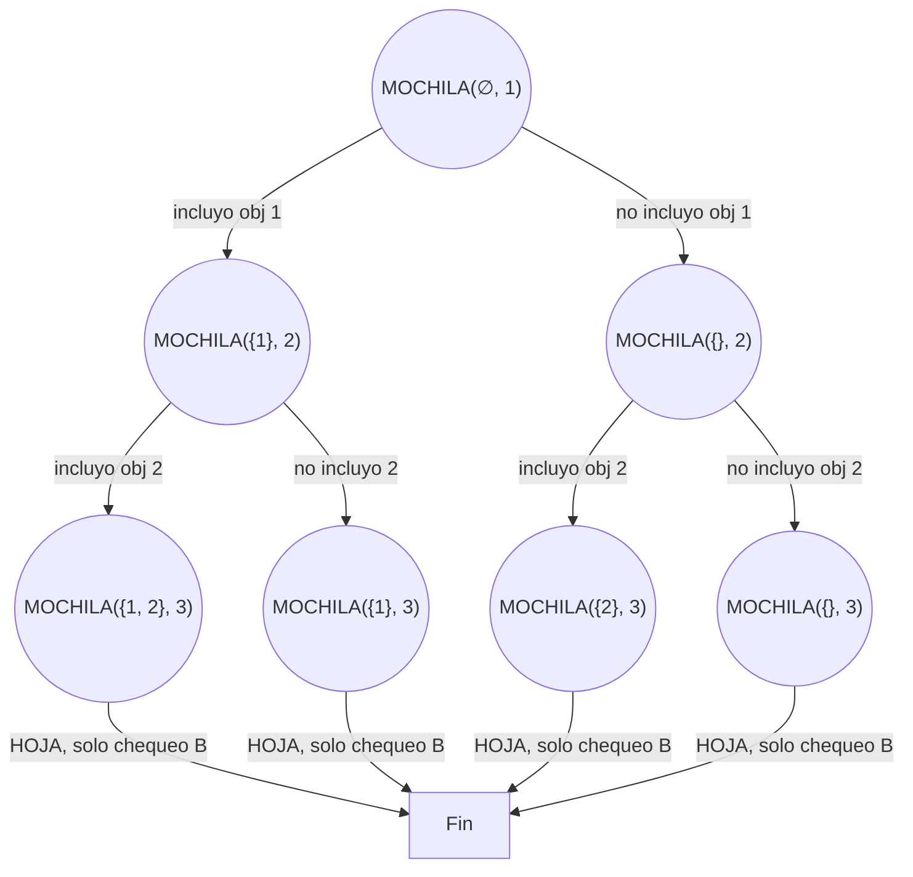

# GUIÓN: Fuerza Bruta y Backtracking

---

## 🎙️ INTRO

Muy buenas buenas mi gente ¿Cómo están?

Hoy vamos a hablar de dos técnicas algorítmicas MUY importantes: Fuerza bruta y backtracking. La primera es lo que uno podría llegar a pensar como "la base del todo" dentro de las técnicas algorítmicas porque es literalmente la única que te **asegura** que va a encontrar la solución para cualquier problema que "le tires", aunque igualmente eso tiene sus contras; la segunda (backtracking) es algo así como un fuerza bruta pero más "sofisticado"...

## Pero antes... una consulta

¿Alguna vez intentaron abrir una cerradura de combinación sin saber el código? (en un contexto de pruebas y no real, por supuesto 👁️)
Si no:
  ¿Por qué no lo has intentado?
si sí:
  ¿Qué hiciste? Seguro que en habrás probado algo como: 0-0-0... 0-0-1... 0-0-2... basicamente probar todas las combinaciones de números posibles hasta que el candado hiciera click y te diera acceso a lo que estaba bloqueando.

Bueno.

Felicitaciones! Acabás de implementar tu primer algoritmo de **fuerza bruta**.

Ahora bien: ¿es eso inteligente (y por inteligente nos referimos a 'eficiente' en realidad)? No, si alguna vez lo intentaste habrás notado que lleva **demasiado** tiempo encontrar la clave (a menos que tengas una suerte galáctica, por supuesto); y... ¿Es correcto (y con correcto nos referimos a si eso nos lleva a una solución correcta del problema)? Absolutamente **sí**, al final estamos probando todas las combinaciones posibles che, no hay manera de que no encontremos a la correcta (si es que tenía claro).


Bueno nada, esa tensión —entre lo correcto y lo eficiente— es exactamente de lo que vamos a hablar hoy.

Vamos a arrancar desde lo más básico, la **fuerza bruta**, y vamos a escalar hasta una
de las técnicas más elegantes y poderosas del diseño de algoritmos: el **backtracking**.

---
---

Antes, introduzcamos algunos conceptos:

## 🧱 Problemas de Optimización Combinatoria

¿"Optimización", "combinatoria"; como a que todos nos suena no? igualmente vamos a darle un repaso con lo necesario para poder entrar en contexto con nuestro tema.

### Primero: ¿Qué es un problema de optimización?

Antes de hablar de cómo resolver problemas, tenemos que entender *qué tipo* de problemas
nos interesan.

Un **problema de optimización** siempre te va a pedir que devuelvas el 'máximo' ó 'mínimo' para algún problema, ejemplitos:
- Quieres hacer las compras pero quieres minimizar la cantidad de dinero que vas a necesitar.
- Quieres vender un producto a bajo precio pero maximizando tus ganancias.
- Te ganaste la oportunidad de llevarte todo lo que quieras de un supermercado siempre y cuando lo que tomes entre en una mochila que tiene una capacidad limitada (**spoiler:** gracias a lo que vas a aprender hoy pudiste maximizar el valor de lo que vas a poder llevarte del super).

Básicamente, un problema de optimización tiene esta forma (siendo un poco más formal)

$\text{Sea } S$ el conjunto de soluciones (combinaciones, si quieres) para un problemita $f$ que toma un subconjunto de $S$ y devuelve un valor para ese subconjuto en cuestión, entonces un problema de optimización siempre busca que

$mejorSolucion = máx(f(x))$ o bien $mejorSolucion = mín f(x)$ para algún $x \in S$. ojo que ese $x$ se refiere al subconjunto de $S$

Los tres ingredientes clave:

- **$f$** es la *función objetivo*: lo que queremos maximizar o minimizar.
- **$S$** es la *región factible*: el conjunto de soluciones válidas.
- **$mejorSolucion$** es el *valor óptimo*: el mejor valor que puede tomar f.
- Y cualquier x tal que f(x) = mejorSolucion es simplemente **un óptimo**.

Analicen eso un ratito.

### Ahora, bien, veamos el adjetivo "combinatoria"

Un problema de **optimización combinatoria** es aquel donde la región factible S está
definida por consideraciones... combinatorias. Ok, pero ¿qué significa eso?

Bueno.

La combinatoria "en sencillo" estudia la **construcción, enumeración y existencia** de configuraciones
de objetos finitos con ciertas propiedades.

Ejemplos típicos de regiones factibles combinatorias:
- Todos los subconjuntos de un conjunto finito (2^n posibilidades).
- Todas las permutaciones de n elementos (n! posibilidades).
- Todos los caminos en un grafo (Apa! "grafo", eso lo veremos muuuucho más adelante).
- Todos los subconjuntos de tamaño k.

Básicamente, el patrón es siempre el mismo: **hay muchas soluciones candidatas**, y queremos
encontrar la mejor.

¿Cuántas es "muchas"? Suficientes como para que probarlas todas una por una sea
potencialmente desastroso. Y acá es donde nace la necesidad de ser inteligentes o trabajar eficientemente.

---
---

Listo, con esos conceptos presentados, vamos de una con las técnicas de hoy

## 💪 Fuerza bruta: El enfoque ingenuo (pero honesto y seguro)

### Definición

Un algoritmo de **fuerza bruta** (también llamado de *búsqueda exhaustiva* o
*generate and test*) consiste en:

1. **Generar** todas las soluciones factibles posibles.
2. **Evaluar** cada una.
3. **Quedarse** con la mejor.

### Pros:
- Generalmente es fácil de implementar.
- Es correcto (siempre que se implemente bien).

> Básicamente, te resuelve todo y es fácil de implementar ¿'Ta piola no?

### Contra:

- No suele ser eficiente. Casi siempre su complejidad temporal/espacial suele ser exponencial.

Ok sí, acá puse una sola contra contra dos pros, el tema es que **esa** contra **es** demasiado contra, se come lo bueno de lo otro por completo en la mayoría de los casos... ¿En la mayoría de los casos? O sea, que ¿Pueden llegar a haber casos donde sí sea útil usar fuerza bruta?

Pues...

**¡Sí!**, pero solo si el tamaño de la instancia es pequeño; en ese caso un algoritmo de fuerza bruta exponencial puede ser perfectamente aceptable. 

Un pro que no dije porque quería primero nombrar lo otro es que fuerza bruta es el punto
de partida conceptual para técnicas que, si bien tal vez no te resuelvan todo problema, los problemas que son capaces de resolver los resuelven en complejidades temporales **mucho** menores!!! .

### Volvamos a la situación de la mochila:

Por si no se acuerdan ya, les tiro de vuelta la situación: "Te ganaste la oportunidad de llevarte todo lo que quieras de un supermercado siempre y cuando lo que tomes entre en una mochila que tiene una capacidad limitada".

O sea que tenemos:
- Una mochila con capacidad máxima **C** (en kg ponele).
- **n** objetos, cada uno con peso **pᵢ** y beneficio **bᵢ**.

Si tuvieran esta oportunidad ¿qué objetos meterían en la mochila?... No sé ustedes pero yo metería lo que para mi fuera lo más valioso (un hermoso set de tarjetas gráficas y RAM 😂😭).

El problema en sí es: queremos elegir qué objetos meter para **maximizar el beneficio total** sin exceder el peso máximo (menos mal que las tarjetas y la RAM no pesan nada).

Antes de entrar nuevamente en lenguaje formal les digo: por ahora, lo voy a hacer yo, pero ustedes van a tener que hacerlo luego porque algún día van a estar solos y van a tener que ser capaces de plantear todo lo que sigue.

Entonces, ahora que ya entendemos al problema y lo que queremos hacer, vamos a bajar todo eso a un dominio que seamos capaces de controlar, el hermoso mundo de la matemática y la computación.

Lo que querríamos identificar entonces es:

- La región factible (el fulano $S$ del que veníamos hablando).
- Nuestra función $f$ que queremos maximizar o minimizar (en este caso maximizar), no es más que el problema en sí mismo.
- Nuestra $mejorSolución$ que es el valor óptimmo (mejor valor posible) para nuestra $f$.

Entonces:

- Nuestra región factible son todos los subconjuntos de los $n$ objetos que pesan menor o igual que $C$.
- Nuestra $f$: vamos a llamarle $mochila$
- Nuestra $mejorSolución$: es la mayor cantidad de objetos que podemos meter en la mochila tales que el peso total de los objetos dentro de la mochila sea menor o igual que $C$.

Hasta acá, todo trivial, (no siempre lo será eh!)

#### Ahora bien ¿Cuántos subconjuntos hay?

Bueno, si lo pensamos un rato (y también si más o menos recordamos alguna clase de álgebra): vamos a tener $n$ objetos, cada uno de ellos puede meterse o no en la mochila, eso se ve más o menos así:

$S = \set{obj_1, \ obj_2, \ obj_3, \ \dots, \ obj_n}$

Si metemos un poco de "ojo combinatorio" podríamos reemplazar cada objeto por la cantidad de opciones que tiene para ser utilizado en este problema (básicamente dos: lo meto o no lo meto).

$S = \set{2_1, \ 2_2, \ 2_3, \ \dots, \ 2_n}$

¿Cuántas combinaciones hay entonces?

Pues, si cada objeto tiene dos combinaciones, entonces tendríamos que hacer la productoria de cada posibilidad de cada objeto, eso nos deja entonces que tenemos $2^n$ combinaciones posibles para poder resolver ese problema.

O sea que de entrada este problema tiene una solución con complejidad exponencial si nos ponemos a calcular cada combinación posible... ¿Y acaso eso es malo? Buenoo, la respuesta a eso es igual a la respuesta para muchas cosas en la computación (potencialmente el 99% confirmado por Newton y Dijkstra), y es que: depende. Si tu instancia de entrada para el algoritmo es muy chica, entonces no es para nada malo, pero si es muy grande entonces no está muy bueno.

Solo imaginalo un momento: 
- Ponele que tienes que $n=4$, bueno ahí tendrías que hacer $2^4=16$ operaciones para poder resolver ese problema; me parece más que razonable.
- Ahora ponele que tienes que $n=30$, bueno ahí tendrías que hacer $2^{30}=1073741824$ operaciones para poder resolver ese problema; una banda, para nada atractivo, prefiero meter cosas al azar antes que realizar semejante cantidad de operaciones.

#### Ok ¿yY ahora?

Bueno. Habiendo pensado en eso sigamos pensando en la estrategia fuerza bruta para este problema.

Ya identificamos todo lo que queríamos y calculamos su complejidad temporal ¿qué más podemos hacer?

Acá tenemos dos opciones: 
1. Plantearlo de forma **aún más formal** y luego implementar el algoritmo/pseudocódigo. 
2. Lanzarnos directo a la implementación/pseudocódigo.

Generalmente, en la vida cotidiana, entre tú y yo, vamos directo a implementar al algoritmo/pseudocódigo. Sin embargo lo más recomendable es plantear esto de forma aún más formal porque acá es donde terminas resolviendo la idea de cómo hacer el paso recursivo o iterativo generalmente (también porque en un contexto donde se te soliciten solo cosas formales siempre te van a estar pidiendo eso, duh...). Vamos a hacer lo más recomendable y luego nos lanzamos al algoritmo.

#### Vamos más formales

Seré directo, puedes empezar a meter un montón de texto formal acerca del problema y va a estar bien (tal vez), pero lo que es clave para poder terminar de plantear esto formalmente es lo que llamaremos "función de recursión", esto es básicamente plantear al problema tal y como se haría en un contexto de definición de funciones recursivas matemáticas, algo así ponele:

$fibonacci(n) = \begin{cases}
0 & \text{si } n = 0 \\
1 & \text{si } n = 1 \\
fibonacci(n-1) + F(n-2) & \text{si } n > 1 
\end{cases}
$

Es literalmente plantear los casos base y el caso recursivo como una definición de función recursiva matemática, eso nada más. A veces es fácil, muchas otras veces no, pero es eso, no hay más.

La posta de esto es que no suele ser fácil mi gente (al menos no en los ejercicios que nos suelen dar), así que acá les dejo algunos mandamientos para poder sacarlar "facilmente" dentro de todo:

1. **NUNCA** olvides los casos base.
2. **NUNCA** olvides el caso recursivo.
3. **NUNCA** mandes por una dirección al problema si las condiciones para eso **no** son las correctas.
4. **SIEMPRE** confia en la Hipótesis Inductiva. No intentes resolver toda la recursión en tu cabeza; asumí que la función ya sabe resolver el problema para un tamaño $n-1$ y ocupate solo de cómo unir eso al elemento actual.
5. **NUNCA** ignores las restricciones del dominio. Si la función está definida para $n \geq 0$, asegurate de que tus llamadas recursivas jamás escapen hacia los números negativos, o vas a romper el dominio del problema.
6. **SIEMPRE** verifica que el tamaño del problema se reduzca. En cada paso recursivo, el argumento debe estar "más cerca" de los casos base. Si el problema no se achica, entrás en un bucle infinito.
7. **NUNCA** mezcles peras con manzanas en el retorno. Si tu función debe devolver un entero, todos los casos base y todas las ramas del caso recursivo deben devolver un entero. La consistencia es ley.
8. **SE VALE** calcular lo mismo dos o más veces si lo haces achicando la entrada. Acá está una gran diferencia con la implementación real: a las funciones matemáticas no les interesa mucho la complejidad temporal, solo les interesa formalizar la lógica para obtener un resultado. Aunque en la práctica (o implementación real), si llamas a la función con los mismos parámetros una y otra vez (como hicimos con $fibonacci$ simple) estarías aumentando la complejidad temporal, a la definición matematico-lógica del problema no le interesa para nada si tienes una PC de la NASA o no, solo le importa dejar bien en claro cómo llegar al resultado.
9. **OJO**, piensa que agregar muchos parámetros de entrada para la función recursiva puede darte un sesgo de lo que es realmente necesario para poder resolver al problema con la menor complejidad posible: **más parámetros de entrada = más combinaciones posibles = mayor complejidad temporal** (siempre y cuando no puedas asumir cosas que te bajen la complejidad drásticamente o los parámetros de entrada estén usados muy eficientemente).


Entonces, si quisieramos hacer esta función recursiva para el problema de la mochila entonces tendríamos que tener en cuenta que:

1. Si la suma de los pesos de los objetos dentro de la mochila superan a la capacidad de la mochila, entonces ya no puedo meter nada más en la mochila.
2. Si no me he pasado de la capacidad máxima de la mochila, entonces puedo seguir agragando objetos.
3. Si tengo un objeto entonces puedo meterlo o no en la mochila.

Vamos paso a paso para poder sacar la función recursiva para este problema. Para poder armarnos esta función medio que tenemos que seguir una serie de pasos para poder lograrlo, vamos a dividirlos en secciones en realidad.

**Me fijo cómo comenzar:**

**Parte 1**

Sabemos que tenemos que hacer -en principio- algo así:

$mochila(*algunos parámetros*) = \dots$

Lo primero de todo es pensar qué conjunto de parámetros es el que es más fácil de manejar aprovechando el noveno mandamiento dado. Además sabemos que tenemos que probar todas las combinaciones de "lo pongo o no lo pongo" con todos los objetos... Podemos hacer algo como que $mochila$ tome un subconjunto de objetos y vaya devolviendo lo mejor de tener esos objetos ¿no? algo así:


$mochila(objetosUsados)$ $\rightarrow$ **opción 1**

Ahora bien, por ahí también podíamos hacer algo como que $mochila$ toma un objeto y se fija si lo pone o no lo pone, ojo es **un** objeto, no todo el subconjunto. Algo así aprox

$mochila(iesimoObjeto)$ $\rightarrow$ **opción 2**

Bien, ya como que tenemos algo más o menos razonable para poder partir nuestro razonamiento para armarnos la función recursiva

**Parte 2**:

Ya que tengo algo con lo que partir me hago la pregunta ¿Cómo puede llegar a fallar esto? o bien ¿Esto en realidad me va a ayudar a hallar una solución? ¿Me estoy olvidando de algo? ¿Hace falta meter algo más?

Bueno, en **este** caso particular:
- No pareciera que la función pueda llegar a fallar si le estoy pasando literalmente lo datos más fundamentales que necesita para poder arrancar.
- Esto sí o sí nos tiene que ayudar a resolver al problema por lo mismo del ítem anterior.
- Estamos dejando por fuera lo siguiente (dentro de los datos que habíamos identificados como relevantes): $C$

Ahora me pregunto: ¿Hace falta meter al $C$? y si sí ¿Lo meto directamente o hay una forma más óptima?

Mmm, bueno en principio como que no está de más meter al $C$ de alguna manera ¿No? Pasa que tenemos que saber bien si nos estamos pasando de la capacidad máxima de la mochila. Pensemos como meterlo...

Si tratamos de meterlo en la opción 1 podríamos llegar a hacer algo así:

$mochila(objetosUsados, C)$ 

y luego podemos ir restando a ese valor de C de forma recursiva ¿no? Medio que suena convincente.

Si tratamos de meterlo en la opción 2 podríamos pensar en algo como esto:

$mochila(iesimoObjeto, C)$

Y se ve igual de convincente si usamos el mismo argumento de la opción 1.

Como ya resolvimos esas dudas medio que podríamos seguir, cualquier cosa volvemos para atrás.

**Parte 3**

Ok entonces tengo algo así:

1. $mochila(objetosUsados, C)$
2. $mochila(iesimoObjeto, C)$

Ahora que ya tenemos los parámetros iniciales planteados, intentemos definir o bien el caso base o el caso recursivo. En general, esto es algo que depende de qué se se te hace más fácil o más difícil, yo -en este caso- voy a plantear el caso recursivo (esto de me fijo lo que me maximiza más entre poner o no poner al objeto):

$mochila(objetosUsados, C) = \begin{cases} 
caso base \\
max(mochila(objetosUsados + \text{un objeto}, C - \text{peso del objeto}) + valor(un objeto), mochila(objetosUsados, C))
\end{cases}
$

Notamos entonces que medio que nos hizo falta saber qué objeto uso ¿No? agreguemos esa info

$mochila(objetosUsados, objeto_i, C) = \begin{cases} 
caso base \\
max(mochila(objetosUsados + objeto_i, \ C - peso(objeto_i)) + valor(objeto_i), mochila(objetosUsados, C))
\end{cases}
$

Acá tendrían que preguntarle a la autoridad que les pida este nivel de formalismo si pueden asumir que tienen una función $peso(objeto)$ que les dice el peso del objeto, si no les dejan asumir eso, entonces pueden manejar el caso del peso modificando estratégicamente los parámetros de entrada (algo del estilo $mochila(objetosUsados, objeto_i, pesoObjeto_i, C)$)

Yo voy a asumir que se vale usar la función $peso$

Si intentamos hacer algo como esto con la opción 2, nos queda algo así:

$mochila(objeto_i, C) = \begin{cases} 
caso base \\
max(mochila(siguiente(objeto_i), \ C - peso(objeto_i)) + valor(objeto_i), mochila(siguiente(objeto_i), C))
\end{cases}
$

Donde $siguiente$ nos da el objeto siguiente al $objeto_i$

Bien, ahora que tenemos el caso recursivo, veamos los casos base.

**Opción 1**

$mochila(objetosUsados, objeto_i, C) = \begin{cases} 
0 & \text{si }C = 0 \lor |objetosUsados| = n+1 \\
max(mochila(objetosUsados + objeto_i, \ C - peso(objeto_i)) + valor(objeto_i), mochila(objetosUsados, C))
\end{cases}
$

**Opción 2**

$mochila(objeto_i, C) = \begin{cases} 
0 &  \text{si }C = 0 \lor objeto_i = \empty \\
max(mochila(siguiente(objeto_i), \ C - peso(objeto_i)) + valor(objeto_i), mochila(siguiente(objeto_i), C))
\end{cases}
$

Biennnnnnnn.

Nuevamente nos volvemos a preguntar lo mismo del **paso 2**. En este caso puede que nos este faltando algo ¿verdad?: nos falta agregar el caso en que el peso del objeto es mayor que la capacidad disponible de la mochila, agreguemos eso.

**Opción 1**

$mochila(objetosUsados, objeto_i, C) = \begin{cases} 
0 & \text{si }C = 0 \lor |objetosUsados| = n+1 \\
mochila(objetosUsados, siguiente(objeto_i), C) & \text{si } peso(objeto_i) \gt C \\
max(mochila(objetosUsados + objeto_i, siguiente(objeto_i), \ C - peso(objeto_i)) + valor(objeto_i), mochila(objetosUsados, siguiente(objeto_i), C)) & \text{caso contrario}
\end{cases}
$

**Opción 2**

$mochila(objeto_i, C) = \begin{cases} 
0 &  \text{si }C = 0 \lor objeto_i = \empty \\
mochila(siguiente(objeto_i), C) & \text{si } peso(objeto_i) \gt C \\
max(mochila(siguiente(objeto_i), \ C - peso(objeto_i)) + valor(objeto_i), mochila(siguiente(objeto_i), C)) & \text{caso contrario}
\end{cases}
$

Bieeennnn. Creo que ahora sí. Igualmente hay que volver a estar haciendose las preguntas del **Paso 2** para poder seguir tratando de encontrar alguna falla en alguna de estas funciones recursivas.

#### Vamos al algoritmo/pseudocódigo

Habiendo ya planteado la función recursiva, medio que es directo ir al algoritmo ó pseudocódigo no? Yo voy a plantear el pseudocódigo con python (sí, la re vivo)

```python

# Opción 1
def mochila(objetosUsados:set[Objeto], objeto_i:Objeto, C:int)->int:

  if C == 0 or objeto_i is None:
    return 0
  
  if peso(objeto_i) > C:
    return mochila(objetosUsados, siguiente(objeto_i), C)

  # no lo meto
  no_lo_meto = mochila(objetosUsados, siguiente(objeto_i), C)

  # lo meto
  nuevo_set:set = copia(objetosUsados)
  nuevo_set.add(objeto_i)
  lo_meto = mochila(nuevo_set, siguiente(objeto_i), C - peso(objeto_i)) + valor(objeto_i)

  return max(lo_meto, no_lo_meto)

# Opción 2
def mochila(objeto_i:Objeto, C:int)->int:

  if C == 0 or objeto_i is None:
    return 0
  
  if peso(objeto_i) > C:
    return mochila(objetosUsados, siguiente(objeto_i), C)

  # no lo meto
  no_lo_meto = mochila(siguiente(objeto_i), C)

  # lo meto
  lo_meto = mochila(siguiente(objeto_i), C - peso(objeto_i)) + valor(objeto_i)

  return max(lo_meto, no_lo_meto)
```

Listo entonces, terminamos de ver cómo plantear más o menos todo esto.

### Otra manera de armar el pseudocódigo:

Otra forma de armar el pseudocódigo de esto es de la siguiente manera:

Defines a B como una variable global que es la mejor suma de valores encontrada en algún paso de la recursión.

Defines a S como tu conjunto de objetos disponibles.

Defines a k como la cantidad de objetos usados.

Planteas este algoritmo:

```
MOCHILA(S ⊆ {1,...,n}, k : ℤ)
  si k = n + 1 entonces
    si peso(S) ≤ C  ∧  beneficio(S) > beneficio(B) entonces
      B ← S
    fin si
  sino
    MOCHILA(S ∪ {k}, k + 1)   // incluimos el objeto k
    MOCHILA(S, k + 1)          // no lo incluimos
  fin si
```

Inicias al algoritmo con B = ∅ y MOCHILA(∅, 1).

Fíjate que el árbol de recursión te queda algo así si tienes $n=2$ objetos:



### Notas para el problema de la mochila

Fijate en la estructura: en cada paso, tomamos una **decisión binaria**. ¿Incluyo al i-ésimo objeto o no? Eso genera un árbol de decisiones binario de profundidad n, con 2^n hojas. La complejidad es **O(2^n)**.

### El Problema de las n Damas: Reduciendo el Espacio


Veamos otro clásico: ubicar n damas en un tablero de ajedrez n×n de manera que
ninguna amenace a otra.

Solución de fuerza bruta naíve: generar todos los subconjuntos de n casillas del tablero n×n.

Para n = 8 eso es un tablero de 64 casillas:

```
2^64 = 18.446.744.073.709.551.616 combinaciones
```

Dieciocho trillones. No, gracias.

Pero espera: sabemos que en cada casilla no puede haber dos damas.
Si exigimos subconjuntos de exactamente n casillas:

```
C(64, 8) = 4.426.165.368 combinaciones
```

Cuatro mil millones. Mejor, pero aún demasiado.

Ahora usemos que cada columna debe tener exactamente una dama.
Representamos cada solución parcial como una tupla (a₁, a₂, ..., a_n) donde
aᵢ ∈ {1,...,8} es la fila de la dama en la columna i:

```
8^8 = 16.777.216 combinaciones
```

Y si además sabemos que cada fila debe tener exactamente una dama (las aᵢ
deben ser todas distintas), estamos hablando de **permutaciones**:

```
8! = 40.320 combinaciones
```

De 18 trillones a 40.320. Solo por pensar mejor el problema.

Pero... ¿Podemos hacerlo aún mejor? Sí. Y acá entra el backtracking. Nos vamos a saltear la parte de implementar la versión en fuerza bruta, es un buen ejercicio hacer esto por ustedes mismos.

Voy tratar de explicar esto más o menos directo pero sin ser poco explicativo. Cualquier cosa me preguntan.

Sabemos entonces que solo podemos colocar una reina por fila y columna del tablero, sabemos también que las reinas se mueven en: vertical, horizontal y en diagonal; por lo tanto, si ubicamos a una reina en una casilla, automáticamente cada una de las casillas que se encuentran en el rango de movimiento de esa reina quedarían inhabilitadas. Juntando todo, podríamos hacer algo como: pongo una reina en una casilla de una fila, luego intento colocar una reina en una casilla "habilitada" de la siguiente fila y hago eso de forma recursiva hasta que haya llegado a una fila que "se sale del tablero" (básicamente, que logramos colocar una reina por fila) o bien que haya colocado $n$ reinas en el tablero. Como función recursiva nos quedaría algo así;

Sea $tableros$ el conjunto de tableros válidos donde queremos ubicar una reina en una posición $i$, $j$; sea $n$ la cantidad de filas y columnas de un $tablero$ en $tableros$.

$
nReinas(fila_i, tableros)_n = \begin{cases}
tableros & \text{si } fila_i \gt n\\
nReinas(fila_i+1, \bigcup_{t \in tableros}{extender(fila_i, t)}) & \text{caso contrario }
\end{cases}
$

$
extender(fila_i, tablero) = \{marcarCasilla(tablero, fila_i, columna_j) \mid 1 \leq columna_j \leq n \land habilitada(fila_i, columna_j, tablero)\}
$


$
habilitada(fila_i, columna_j, tablero) = \begin{cases} 
True & \text{si } noHayReinaEnFila(fila_i, tablero) \land noHayReinaEnColumna(columna_j, tablero) \land noHayReinaEnDiagonal(fila_i, columna, tablero) \\
False & \text{caso contrario}
\end{cases}
$

$
noHayReinaEnFila(fila_i, tablero) = \sum_{j=0}^{n}{tablero[fila_i][j]} = 0 \\
noHayReinaEnColumna(columna_j, tablero) = \sum_{i=0}^{n}{tablero[i][columna_j]} = 0 \\
noHayEnDiagonal(fila_i, columna_j, tablero) = \forall (r, c) \in tablero \mid tablero[r][c] = 1 \implies  |fila_i - r| \neq |columna_j - c| \\
$

$
marcarCasilla(tablero, fila_i, columna_j) = T \mid (\forall (r, c) \in tablero \land r \neq fila_i \land c \neq columna_j \implies T[r][c] = tablero[r][c]) \land T[fila_i][columna_j] = 1
$

> Puede que sea medio complicado ver cómo funciona el $noHayEnDiagonal$ piensenlo como que: si una casilla (ponele que se llama $c_1$) está en diagonal a otra (ponele que se llama $c_2$), entonces si el resultado de hacer $|fila_{c_1} - fila_{c_2}| = |columna_{c_1} - columna_{c_2}|$ eso te dice si están en la misma diagonal o no! Pues las diagonales son el lugar geométrico donde el desplazamiento vertical es igual al horizontal. Recomiendo buscar información sobre esto en internet.

Finalmente, el pseudocódigo en python quedaría así:


```python

def habilitada(fila_i:int, columna_j:int, tablero:list[list[int]])->bool:
  
  # recorro las filas
  for i in range(0, n):
    if i != fila_i:
      if tablero[i][columna_j] == 1:
        return False
  
  # recorro las columnas
  for j in range(0, n):
    if j != columna_j:
      if tablero[fila_i][j] == 1:
        return False
  
# recorro las diagonales
  for i in range(n):
    for j in range(n):
      # Si hay una reina en (i, j) y no es la posición que estoy evaluando
      if tablero[i][j] == 1 and (i != fila_i or j != columna_j):
        # Aplicamos la magia: si la distancia en filas es igual a la de columnas
        if abs(i - fila_i) == abs(j - columna_j):
          return False
          
  return True

def extender(fila_i:int, tablero:list[list[int]]):
    
    n = len(tablero)
    nuevos_tableros:set = set()
    for j in range(n):
      if habilitada(fila_i, j, tablero):
        tablero_nuevo = copiar(tablero)
        tablero_nuevo[fila_i][j] = 1
        nuevos_tableros.add(tablero_nuevo)
          
    return nuevos_tableros

def nReinas(fila_i:int, tableros:set[list[list[int]]]):

  n = 0
  if tableros: # si tenemos a un conjunto con al menos un elemento.
    un_tablero = tablero.pop()
    tableros.add(un_tablero)
    n += len(un_tablero)

  if fila_i == n:
    return tableros

  proximo_nivel_tableros:set = set()
  for tablero in tableros:
    tableros_validos = extender(fila_i, tablero)
    proximo_nivel_tableros += tableros_validos

  # Si no hay más tableros válidos, no tenemos nada que devolver
  if not proximo_nivel_tableros:
    return set()

  return nReinas(fila_i + 1, proximo_nivel_tableros)

"""
Inicializamos esto como

conj_init = el conjunto cuyo único elemento es una matriz de nxn con todas sus posiciones iguales a 0

nReinas(0, conj_init)
"""
```

Un quilombo, lo sé, pero es necesario hacer estas cosas para poder tener un entendimiento más profundo de estos temas.

Igualmente ya sabemos que esto no es del todo óptimo no? Entonces sigamos con algo que pueda mejorar ambos casos de estos problemas que estuvimos viendo.

---

## 🌲 BLOQUE 3 — Backtracking: Explorar con Criterio

### La Idea Central

El backtracking es una mejora sistemática sobre la fuerza bruta.

La idea es esta: en vez de generar **todas** las soluciones candidatas y después filtrar,
vamos construyendo las soluciones de a poco —una componente a la vez— y en cuanto
detectamos que una configuración **parcial** no puede llevar a ninguna solución válida,
la **descartamos inmediatamente** sin explorar todo el subárbol que vendría después.

Formalmente:

> **Backtracking:** Recorrer sistemáticamente todas las posibles configuraciones del
> espacio de soluciones de un problema, eliminando las configuraciones parciales que
> no puedan completarse a una solución.

### Vocabulario Fundamental

> Importante: esto aparece en exámenes y en la práctica siempre

Antes de seguir, fijemos el vocabulario:

**Solución candidata:** una configuración completa del vector de decisión. Es una
respuesta posible al problema. Puede ser válida o no.

**Solución válida (factible):** una solución candidata que satisface todas las
restricciones del problema.

**Solución parcial:** una configuración incompleta — solo las primeras k componentes
del vector de decisión están fijadas, con k < n. Es el estado del algoritmo en un nodo
interno del árbol de búsqueda.

**Árbol de backtracking:** el árbol donde cada nodo es una solución parcial, la raíz
es la solución parcial vacía, y los hijos de un nodo son todas las extensiones posibles
de esa solución parcial agregando un elemento más al vector.

**Ejemplito (volvemos a la mochila)**

Para la mochila con n = 3 objetos:
- Las **soluciones candidatas** son todos los vectores binarios de longitud 3:
  (0,0,0), (0,0,1), (0,1,0), ..., (1,1,1). Hay 2³ = 8.
- Las **soluciones válidas** son aquellas cuyo peso total ≤ C.
- Las **soluciones parciales** son los vectores de longitud 0, 1 o 2:
  (), (0), (1), (0,0), (0,1), (1,0), (1,1).

### La Estructura del Algoritmo

El algoritmo genérico de backtracking para **encontrar todas las soluciones** se ve más o menos así:

Sea $a$ una solución parcial, y $k$ el número del "paso" en que llegamos a $a$.

```python
def algoritmo_BT(a, k):
  
  if a es solucion valida:
    procesar(a) # basicamente hacer algo con esa solución válida, potencialmente solo retornala.
    return
  
  for solu_parcial in Sucesores(a, k):
    algoritmo_BT(solu_parcial, k+1)
```

Y para **encontrar una sola solución** (la primera que aparezca):

```python
def algoritmo_BT(a, k)
  if a es solución válida:
    sol = a # sol es una variable global que tiene una solución válida. Puede manejarse de otra manera, usarla como retorno directo por ejemplo
    encontró = true # acá también tenemos una variable global, podemos usar un retorno directo con este valor.
  else:
    for solu_parcial in Sucesores(a, k)
      algoritmo_BT(solu_parcial, k + 1)
      si encontró entonces
        return
```

La clave está en que sepamos que `Sucesores(a, k)` es el conjunto de extensiones válidas de la solución parcial `a` en el paso `k`. Si ese conjunto está vacío (o si podemos detectar que ninguna extensión puede llegar a una solución), **retrocedemos** (hacemos "back").

### Las Podas: El Corazón del Backtracking

Aquí es donde el backtracking se vuelve poderoso. Las **podas** son condiciones que
nos permiten descartar ramas enteras del árbol de búsqueda sin explorarlas.

Hay dos tipos principales:

#### Poda por Factibilidad

> Idea: "Esta rama no puede llevar a ninguna solución válida."

Ejemplo con la mochila: si el peso acumulado ya supera C, no importa qué más agreguemos, jamás vamos a tener una solución válida. Podamos.

**vamos a usar una implementación de mochila que tiene peor complejidad que la que ya teníamos**

```python

# Opción 1
def mochila(objetosUsados:set[Objeto], objeto_i, peso_acumulado:int, C:int)->int:

  if peso_acumulado > C or objeto_i is None: # la poda es peso_acumulado > C
    return 0
  
  # no lo meto
  no_lo_meto = mochila(objetosUsados, siguiente(objeto_i), peso_acumulado, C)

  # lo meto
  nuevo_set:set = copia(objetosUsados)
  nuevo_set.add(objeto_i)
  lo_meto = mochila(nuevo_set, siguiente(objeto_i), peso(objeto_i) + peso_acumulado, C) + valor(objeto_i)

  return max(lo_meto, no_lo_meto)

# Opción 2
def mochila(objeto_i:Objeto, peso_acumulado:int, C:int)->int:

  if peso_acumulado > C or objeto_i is None: # la poda es peso_acumulado > 0
    return 0
  
  # no lo meto
  no_lo_meto = mochila(siguiente(objeto_i), peso_acumulado, C)

  # lo meto
  lo_meto = mochila(siguiente(objeto_i), peso_acumulado + peso(objeto_i), C) + valor(objeto_i)

  return max(lo_meto, no_lo_meto)
```

#### Poda por Optimalidad (Branch and Bound)

> Idea: "Esta rama no puede llevar a ninguna solución **mejor** que la mejor que ya tengo."

Ejemplo con la mochila: si el beneficio acumulado más el beneficio máximo posible de los objetos restantes (tomándolos todos) sigue siendo menor al mejor beneficio encontrado hasta ahora, tampoco vale la pena explorar:

```python

mejor_acumulado:int = 0

# Opción 1
def mochila(objetosUsados:set[Objeto], objeto_i:Objeto, C:int)->int:
  global mejor_acumulado

  if C == 0 or objeto_i is None:
    mejor_acumulado = max(valor_total(objetosUsados), mejor_acumulado)
    return None
  
  if peso(objeto_i) > C:
    return mochila(objetosUsados, siguiente(objeto_i), C)

  sig_parc:int = 0
  for objeto in ObjetosNoUsados:
    sig_parc += valor(objeto)

  if valor_total(objetosUsados) + sig_parc > mejor_acumulado:

    # no lo meto
    mochila(objetosUsados, siguiente(objeto_i), C)

    # lo meto
    nuevo_set:set = copia(objetosUsados)
    nuevo_set.add(objeto_i)
    mochila(nuevo_set, siguiente(objeto_i), C - peso(objeto_i))

# Opción 2
def mochila(objeto_i:Objeto, valor_acumulado:int, C:int)->int:
  global mejor_acumulado

  if C == 0 or objeto_i is None:
    mejor_acumulado = max(mejor_acumulado, valor_acumulado)
    return None
  
  if peso(objeto_i) > C:
    return mochila(siguiente(objeto_i), valor_acumulado, C)

  sig_parc:int = 0
  objeto_siguiente = siguiente(objeto_i)
  while objeto_siguiente is not None:
    sig_parc += valor(objeto_siguiente)
    objeto_siguiente = siguiente(objeto_siguiente)

  if valor_acumulado + sig_parc > mejor_acumulado:
    # no lo meto
    mochila(siguiente(objeto_i), valor_acumulado, C)

    # lo meto
    mochila(siguiente(objeto_i), valor_acumulado + valor(objeto_i), C - peso(objeto_i))
```

**Otra manera de escribir esto**

```
MOCHILA(S, k)
  si k = n + 1 entonces
    si peso(S) ≤ C ∧ beneficio(S) > beneficio(B) entonces
      B ← S
    fin si
  sino si peso(S) ≤ C  ∧  benef(S) + Σ(i=k+1 a n) bᵢ > benef(B) entonces
    MOCHILA(S ∪ {k}, k + 1)
    MOCHILA(S, k + 1)
  fin si
```

Ese segundo algoritmo con poda por optimalidad se llama habitualmente **branch and bound**. Es una herramienta muy poderosa en la práctica. Tambien noten que pudimos meter la poda por factibilidad.

Ahora, planteemos una situación: si nosotros quisieramos encontrar todos las maneras de poder distribuir n reinas en un tablero de $n\times n$ entonces ¿Qué tipo de poda podríamos haccer? ¿Y si quisieramos solo **una** distribución de las reinas en el tablero?

Espero que lo hayan pensado bien.

La respuesta es la siguiente:

- Si queremos encontrar todas las distribuciones posibles, entonces solo podemos hacer una poda por factibilidad que sería descartar los tableros donde la posición de una reina hace que esté en el camino de otra (lo que detecta nuestra función $habilitada$). No popdríamos hacer una poda por optimalidad porque no queremos maximizar ni minimizar nada, simplemente queremos todo.
- Si quisieramos **una** sola solución, entonces lo que haríamos es una poda por "optimalidad" (en realidad se le dice por satisfacción), que sería cortar la ejecución del algoritmo apenas tengamos un resultado válido. Podemos combinar igualmente la poda por factibilidad en este caso.

Eso es todoooooooooo.