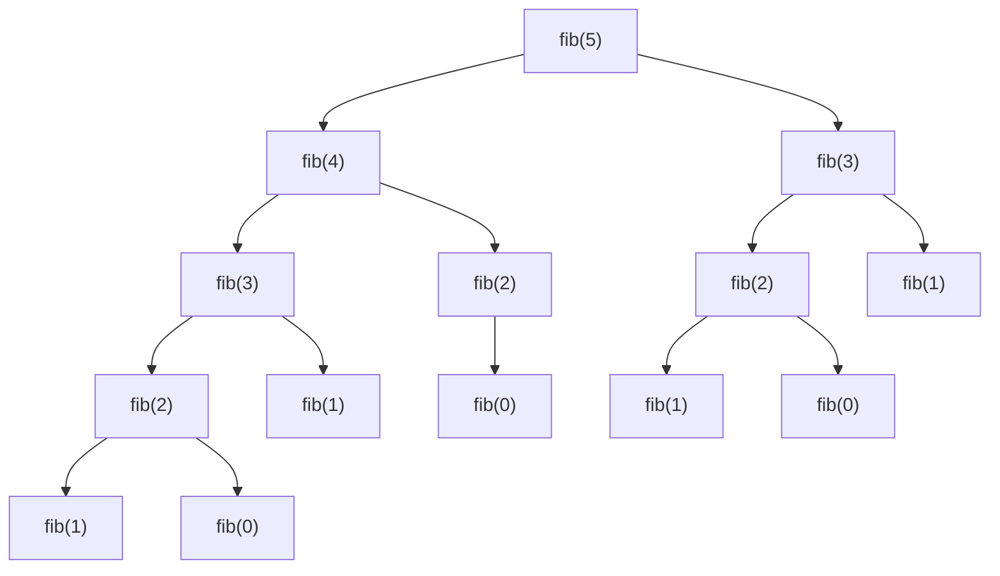

# GUIÓN: Programación Dinámica

---

## 🎙️ INTRO

Muy buenas buenas mi gente ¿Cómo están?

Hoy vamos a hablar de algo que, con toda honestidad, es de las técnicas más elegantes y poderosas que existen en el diseño de algoritmos: **Programación Dinámica**, o como le vamos a decir de acá en más: **PD** (o **DP** si leen en inglés, que lo van a ver muuuucho).

Pero antes de entrar en materia, quiero que se queden con esta idea:

> "Programación Dinámica no es una técnica, es una **filosofía**."

No exagero. La idea detrás de PD es tan general y tan poderosa que va a cambiar para siempre cómo piensan en problemas. Cuando la internalizan de verdad, van a empezar a verla en todos lados.

Ahora bien, para poder entender PD desde cero, necesitamos arrancar desde algo que ya conocemos y que probablemente les dejó un sabor amargo la última vez que lo vieron: la **fuerza bruta recursiva**.

¿Listos? Vamos.

---

## 🤔 El Problema Con Lo Que Ya Sabemos

Supongamos que queremos calcular el n-ésimo número de Fibonacci. Si recuerdan:

$$
fibonacci(n) = \begin{cases}
1 & \text{si } n \leq 1 \\
fibonacci(n-1) + fibonacci(n-2) & \text{si } n > 1
\end{cases}
$$

Directo al código recursivo:

```python
def fib(n: int) -> int:
    if n <= 1:
        return 1
    return fib(n - 1) + fib(n - 2)
```

Bonito, simple, elegante. Pero... ¿qué pasa si lo corremos con `n = 40`? O `n = 50`?

Se les va a ir la computadora a descansar un rato largo.

¿Por qué? Dibujemos (simplificado) el árbol de llamadas para `fib(5)`:



¿Ven el problema? `fib(3)` se calcula **dos veces**. `fib(2)` se calcula **tres veces**. Y eso que apenas llegamos a `fib(5)`. Para `n = 50`, la misma historia se multiplica exponencialmente hasta llegar a un árbol de llamadas con del orden de $\Omega(2^{n/2})$ nodos. Eso es una barbaridad.

Pero acá viene la pregunta que lo cambia todo:

**¿Cuántos resultados *distintos* puede devolver `fib`?**

`fib(0)`, `fib(1)`, `fib(2)`, ..., `fib(n)`. Exactamente **n+1** resultados distintos posibles. Sin embargo hacemos exponencialmente más llamados que eso.

Esto tiene nombre, y es el corazón de la Programación Dinámica. Se llama **superposición de problemas** (o *overlapping subproblems* en inglés): estamos resolviendo los mismos subproblemas una y otra y otra vez. Si pudiéramos *recordar* los resultados que ya calculamos y simplemente reutilizarlos... nos ahorraríamos una cantidad absurda de trabajo.

Exactamente eso es PD: **recursión con memoria**.

---

## 🧠 La Idea Central: Recordar Para No Repetir

Formalmente, la Programación Dinámica se basa en dos propiedades que un problema debe tener para que la técnica funcione:

**1. Superposición de subproblemas:** El árbol de recursión tiene muchos más llamados que estados (combinaciones de parámetros) posibles. Esto garantiza que hay llamados repetidos que vale la pena cachear (recordar).

**2. Subestructura óptima:** La solución óptima al problema se puede construir a partir de las soluciones óptimas de sus subproblemas. (Esto lo vamos a ver implícitamente en cada ejemplo.)

Si un problema tiene estas dos propiedades, PD puede transformar un algoritmo exponencial en uno polinomial. No es magia, es matemática.

---

## 📋 La Receta: Seis Pasos Para Dominar PD

Antes de ver cómo funciona esto en práctica, les dejo la receta que vamos a seguir para **cualquier** problema de PD. Memorícenla, vívanlá, sueñen con ella:

1. **Definir la función recursiva** $f$.
2. **Explicar la semántica** de $f$: qué significa cada parámetro, cada caso base, cada paso recursivo.
3. **Determinar el/los llamados** que resuelven el problema original.
4. **Probar que $f$ tiene superposición** de subproblemas (que el número de llamados supera al número de estados posibles).
5. **Definir el algoritmo** con PD (la memoria).
6. **Determinar la complejidad** del algoritmo.

Vamos a aplicar esta receta una y otra vez. Con cada problema que veamos, los seis pasos. No se salteen ninguno.

---
---

## 🔁 PARTE 1 — Top-Down: Memoización

La primera forma de implementar PD se llama **Top-Down** o **memoización**. La idea es muy simple: tomamos nuestra función recursiva, le agregamos una memoria (una tabla o diccionario), y antes de calcular cualquier cosa verificamos si ya lo calculamos antes. Si ya lo hicimos, devolvemos el resultado guardado. Si no, lo calculamos y lo guardamos antes de retornar.

Volvamos a Fibonacci y hagamos esto paso a paso, aplicando la receta.

### Paso 1: La Función Recursiva

Ya la teníamos:

$$
f(n) = \begin{cases}
1 & \text{si } n \leq 1 \\
f(n-1) + f(n-2) & \text{si } n > 1
\end{cases}
$$

### Paso 2: Semántica

- El parámetro $n$ representa el índice del número de Fibonacci que queremos calcular.
- Los casos base $n = 0$ y $n = 1$ representan los primeros dos términos de la sucesión, que valen 1 directamente.
- El paso recursivo calcula el n-ésimo término como la suma de los dos anteriores.

### Paso 3: Llamado que resuelve el problema

Para el n-ésimo Fibonacci, simplemente llamamos a $f(n)$.

### Paso 4: Superposición de Subproblemas

Contemos los llamados y los estados:

- **Llamados recursivos:** En el peor caso (todos distintos, árbol completo) el árbol tiene altura $n$ y en cada nivel duplica los nodos. Esto nos da $\Omega(2^{n/2})$ llamados (porque va a haber una rama donde siempre se disminuya a n en 2 por lo tanto vamos a tener **al menos** $\Omega{2^{\frac{n}{2}}}$ nodos en el árbol); es una cota inferior pequeña, sí, pero válida para esta explicación.

- **Estados posibles:** Los parámetros de $f$ son solo uno: $n$, que toma valores en $\{0, 1, \ldots, n\}$. Hay exactamente $n+1$ estados.

Claramente $n+1 \ll 2^{n/2}$ para cualquier $n$ grande. Superposición confirmada.

#### Antes de seguir: pensemos

Venimos hablando que se repiten los llamados recursivos mucho más que la cantidad de estados posibles (combinaciones de parámetros posibles para los amigos) y que con programación dinámica lo que queremos es "acordarnos" en tiempo de ejecución que el resultado de haber hecho un llamado recursivo... ¿Cómo se les ocurre que podemos hacer eso con PD? 

Lo primero que tendríamos que pensar es **dónde** nos guardamos los resultados, y luego **cómo** accedemos a ellos de forma estratégica para poder "recordar" los llamados recursivos anteriores. Acá es donde entra el ingenio, el notar patrones, intuición, y lo más importante: **la práctica**. Siempre siempre siempre les conviene pensar profundamente cómo pueden usar PD en un ejercicio y, en el caso de que no puedan avanzar porque tengan algún bloqueo, una ayudita nunca está de más 😉.

Vamos con este primer ejemplo entonces

### Paso 5: El Algoritmo Con Memoria

El "parche" de PD es minimalista y tiene solo tres ingredientes:

1. Inicializar la memoria (una tabla de tamaño $n+1$, todo indefinido).
2. Al inicio de la función, chequear si el estado ya fue calculado. Si sí, retornar ese valor.
3. Antes de retornar en el paso recursivo, guardar el resultado en la memoria.

```python
# La memoria vive "afuera" de la función, inicializada con un valor centinela
INDEFINIDO = -1
memoria = [INDEFINIDO] * (n + 1)

def fib(i: int) -> int:
    # Caso base: los sabemos directamente
    if i <= 1:
        return 1

    # Paso 2: si ya lo calculé antes, lo devuelvo en O(1)
    if memoria[i] != INDEFINIDO:
        return memoria[i]

    # Lo calculo normalmente...
    resultado = fib(i - 1) + fib(i - 2)

    # Paso 3: ...lo guardo antes de retornar
    memoria[i] = resultado

    return resultado
```

> ⚠️ **Trampa clásica:** A veces se tiene el impulso de parchear *cada llamado recursivo interno* con chequeos de memoria, en lugar de parchear al inicio de la función. Eso es **incorrecto** como práctica y riesgoso: uno puede terminar leyendo posiciones inválidas de la memoria. La responsabilidad del chequeo le pertenece a la función para *su propio estado*, no a los llamados que hace. La función no debe preocuparse por los estados ajenos.

**¿Ejemplo de qué NO hacer?**

```python
# Forma incorrecta y peligrosa de parchear
def fib_mal(i: int) -> int:
    if i <= 1:
        return 1

    # Chequear memoria antes de cada llamado interno es riesgoso:
    # si i == 1, acceder a memoria[i - 2] = memoria[-1] puede dar basura o error
    if memoria[i - 1] != INDEFINIDO:
        anterior = memoria[i - 1]
    else:
        anterior = fib_mal(i - 1)
        memoria[i - 1] = anterior  # ← guardando en el estado ajeno, innecesario

    if memoria[i - 2] != INDEFINIDO:
        anterior2 = memoria[i - 2]
    else:
        anterior2 = fib_mal(i - 2)
        memoria[i - 2] = anterior2

    return anterior + anterior2
```

Esto puede funcionar a veces, pero es difícil de razonar, propenso a errores de índice y totalmente innecesario. La versión correcta es mucho más limpia.

### Paso 6: Complejidad

Con PD, la complejidad de un algoritmo es:

$$\text{Complejidad} = \underbrace{(\text{cantidad de estados})}_{\text{cuántos valores distintos puede tomar } f} \times \underbrace{(\text{costo de calcular un estado})}_{\text{sin contar llamados recursivos ya cacheados}}$$

Para Fibonacci:
- **Estados:** $O(n)$ (los valores $f(0), f(1), \ldots, f(n)$).
- **Costo por estado:** Hacemos 2 llamados recursivos y sumamos. Eso es $O(1)$ si asumimos que los llamados ya están cacheados.
- **Total:** $O(n)$. De exponencial a lineal. 🎉

La **complejidad espacial** sigue la misma lógica: $O(n)$ estados, cada uno almacena un número ($O(1)$), total $O(n)$.

---

# Vamos con algunos ejercicios sí señorrrrr

## 🏖️ Ejemplo 1 — Vacaciones

Ahora que ya entendemos la mecánica, vamos a resolver un problema real de Codeforces. Les presento las *Vacaciones*.

Este es el link: https://codeforces.com/problemset/problem/698/A

### El Problema

Vasya tiene $N$ días de vacaciones. Para cada día se le indica qué actividades están disponibles mediante un número:

- $0$: no hay actividades disponibles (solo puede descansar).
- $1$: solo hay **competición** disponible.
- $2$: solo hay **gym** disponible.
- $3$: están disponibles **ambas actividades**.

Las reglas son:

- Vasya puede realizar una actividad **disponible**, siempre que no haya hecho **la misma actividad el día anterior**.
- También puede optar por **descansar** cualquier día.
- El objetivo es **minimizar la cantidad de días de descanso**.

Lo que nos dan:

- El número $N$ de días que Vasya tiene de vacaciones.
- Un arreglo de tamaño $N$ donde la i-ésima posición indica un entero $e$ tal que $0 \leq e \leq 3$ que indica qué es lo que puede hacer Vasya en el i-ésimo día de sus vacaciones.

### Paso 1: La Función Recursiva

¿Qué necesitamos saber en cada paso recursivo para poder tomar la decisión correcta?

- El **día actual** en que estamos (parámetro $i$, de $0$ a $N-1$).
- La **última actividad** que hizo Vasya (parámetro $j$, que puede ser GYM, COMP, o DESC).

Con eso armamos la firma: $f(i, j)$ = mínima cantidad de días de descanso desde el día $i$ en adelante, dado que la última actividad que hizo Vasya fue $j$.

Los casos base y recursivo:

$$
f(i, j) = \begin{cases}
0 & \text{si } i = N \quad (\text{no quedan días}) \\
\min\!\Big(1 + f(i+1, \text{DESC}),\ \big[ f(i+1, \text{GYM}) \text{ si puedeGym}(i,j)\big],\ \big[f(i+1, \text{COMP}) \text{ si puedeComp}(i,j)\big]\Big) & \text{si } i < N
\end{cases}
$$

La idea es: en cada día, Pepi siempre tiene la opción de descansar (sumando 1 al costo), y adicionalmente puede hacer gimnasio o competencia si están disponibles y no las hizo el día anterior.

### Paso 2: Semántica

- $i$ es el día actual que estamos evaluando.
- $j$ es la última actividad realizada (nos permite saber si la actividad de hoy está "prohibida").
- El caso base dice: si ya recorrimos todos los días, el costo de descanso adicional es 0.
- El paso recursivo elige la acción que minimiza los descansos totales.

### Paso 3: Llamado Inicial

El primer día es $i = 0$. Antes del primer día, Pepi no hizo nada, así que la "última actividad" puede ser DESC (descanso), que no restringe nada.

```
respuesta = f(0, DESC)
```

### Paso 4: Superposición

- **Estados:** $N$ días × 3 actividades posibles = $O(3N) = O(N)$ estados.
- **Llamados recursivos:** Si siempre hay actividades disponibles, cada paso hace hasta 3 llamados, con árbol de altura $N$: $\Omega(2^N)$ llamados.

$N \ll 2^N$ siempre (para $N > 1$). Superposición garantizada sin condiciones.

### Paso 5: Algoritmo Con Memoria

La memoria tiene dos dimensiones: `[dia][ultima_actividad]`. Usamos $-1$ como centinela.

Definamos constantes: `GYM = 0`, `COMP = 1`, `DESC = 2`.

```python
# Constantes
GYM, COMP, DESC = 0, 1, 2

# n = cantidad de dias
# gym[i], comp[i] = booleanos indicando si el gimnasio/competencia está disponible el día i

memoria = [[-1] * 3 for _ in range(n)]

def f(dia: int, ult_act: int) -> int:
    # Caso base: llegamos al final, costo adicional 0
    if dia == n:
        return 0

    # Chequeo de memoria
    if memoria[dia][ult_act] != -1:
        return memoria[dia][ult_act]

    # Siempre podemos descansar (costo 1 + lo que viene)
    min_descansos = 1 + f(dia + 1, DESC)

    # Podemos hacer gym si está disponible y el día anterior no lo hicimos
    if gym[dia] and ult_act != GYM:
        min_descansos = min(min_descansos, f(dia + 1, GYM))

    # Podemos hacer competencia si está disponible y el día anterior no la hicimos
    if comp[dia] and ult_act != COMP:
        min_descansos = min(min_descansos, f(dia + 1, COMP))

    # Guardamos antes de retornar
    memoria[dia][ult_act] = min_descansos
    return min_descansos

print(f(0, DESC))
```

### Paso 6: Complejidad

- **Estados:** $O(N)$.
- **Costo por estado:** A lo sumo 3 llamados recursivos y tomamos el mínimo → $O(1)$.
- **Total: $O(N)$**.

---

## 🦆 Ejemplo 2 — Las Legiones de César

Sigamos con otro clásico, más interesante porque el modelado del estado va a requerir pensar bien.

### El Problema

El general César forma una línea de tropas con $P$ patos y $D$ dodos. La restricción es:
- No puede haber más de $MP$ patos **consecutivos**.
- No puede haber más de $MD$ dodos **consecutivos**.
- Los patos son indistinguibles entre sí, y lo mismo los dodos.

Queremos **contar** cuántas formaciones válidas existen.

### La Función Recursiva (Versión Con Memoria Óptima)

Después de un proceso de refinamiento, la función recursiva que vamos a usar es esta:

$$
f(np, nd, cp, cd) = \begin{cases}
1 & \text{si } np = 0 \land nd = 0 \\
f(np-1,\ nd,\ cp-1,\ MD) + f(np,\ nd-1,\ MP,\ cd-1) & \text{si } np > 0 \land cp > 0 \land nd > 0 \land cd > 0 \\
f(np-1,\ nd,\ cp-1,\ MD) & \text{si } np > 0 \land cp > 0 \land (nd = 0 \lor cd = 0) \\
f(np,\ nd-1,\ MP,\ cd-1) & \text{si } nd > 0 \land cd > 0 \land (np = 0 \lor cp = 0) \\
0 & \text{en otro caso}
\end{cases}
$$

La idea clave del modelado: llevamos dos contadores $cp$ y $cd$ que indican **cuántos patos y dodos más podemos poner consecutivamente** desde la posición actual. Cuando ponemos un pato, decrementamos $cp$ y reseteamos $cd$ a $MD$ (porque el "contador" de dodos consecutivos se reinicia para la próxima vez que pongamos dodos). Esto nos permite controlar la restricción de consecutivos sin necesidad de saber quién fue la "última tropa" como parámetro separado.

### Semántica

$f(np, nd, cp, cd)$ devuelve la cantidad de formas válidas de colocar $np$ patos y $nd$ dodos restantes, donde todavía podemos poner hasta $cp$ patos consecutivos más y hasta $cd$ dodos consecutivos más. La llamada inicial es:

$$
f(P,\ D,\ MP,\ MD)
$$

porque al principio no pusimos nada aún y tenemos la cuota completa disponible en ambas tropas.

### Superposición

- **Estados:** Los parámetros son $np \in [0, P]$, $nd \in [0, D]$, $cp \in [0, MP]$, $cd \in [0, MD]$. En total: $O(P \cdot D \cdot MP \cdot MD)$ estados.
- **Llamados:** En cada paso recursivo podemos hacer hasta 2 llamados, y la "altura" del árbol es $P + D$ (porque siempre decrementamos $np$ o $nd$). Eso nos da $\Omega(2^{P+D})$ llamados en el peor caso.

Para $P + D > 1$ claramente $P \cdot D \cdot MP \cdot MD \ll 2^{P+D}$. Superposición confirmada.

### Código Top-Down

```python
P: int
D: int
MP: int
MD: int
memo: list  # memo[np][nd][cp][cd]

PATO: int = 0
DODO: int = 1
MOD: int = 100000000

def tomar_entrada_cesar_legions():
    global P, D, MP, MD, memo

    P, D, MP, MD = tuple(map(int, input().split(" ")))

    # memo de 4 dimensiones: [patos restantes][dodos restantes][cuota patos][cuota dodos]
    memo = []
    for _ in range(P + 1):
        fila_P: list = []
        for _ in range(D + 1):
            fila_D: list = []
            for _ in range(MP + 1):
                fila_MP: list = []
                for _ in range(MD + 1):
                    fila_MP.append(-1)
                fila_D.append(fila_MP)
            fila_P.append(fila_D)
        memo.append(fila_P)

def cesar_legions(np: int, nd: int, cant_p_fila: int, cant_d_fila: int) -> int:
    # Caso base: no quedan tropas, hay exactamente 1 forma (no poner nada)
    if np == 0 and nd == 0:
        return 1

    # Chequeo de memoria
    if memo[np][nd][cant_p_fila][cant_d_fila] != -1:
        return memo[np][nd][cant_p_fila][cant_d_fila]

    combinaciones: int = 0

    # Intentamos poner un pato: solo si quedan patos (np > 0) y aún tenemos cuota (cant_p_fila > 0)
    # Al hacerlo, decrementamos cant_p_fila y reseteamos cant_d_fila a MD
    if np > 0 and cant_p_fila > 0:
        combinaciones += cesar_legions(np - 1, nd, cant_p_fila - 1, MD)

    # Intentamos poner un dodo: solo si quedan dodos (nd > 0) y aún tenemos cuota (cant_d_fila > 0)
    # Al hacerlo, reseteamos cant_p_fila a MP y decrementamos cant_d_fila
    if nd > 0 and cant_d_fila > 0:
        combinaciones += cesar_legions(np, nd - 1, MP, cant_d_fila - 1)

    combinaciones %= MOD

    memo[np][nd][cant_p_fila][cant_d_fila] = combinaciones
    return combinaciones

# Inicializar y llamar:
# tomar_entrada_cesar_legions()
# print(cesar_legions(P, D, MP, MD))
```

### Complejidad

- **Estados:** $O(P \cdot D \cdot MP \cdot MD)$.
- **Costo por estado:** En cada llamado hacemos a lo sumo 2 llamados recursivos y una suma → $O(1)$.
- **Total: $O(P \cdot D \cdot MP \cdot MD)$**.

Para $P, D, MP, MD \in O(N)$, en el peor caso eso es $O(N^4)$... que suena terrible, pero en la práctica los rangos de $cp$ y $cd$ suelen ser mucho más acotados que $P$ y $D$ respectivamente, y en los casos típicos del problema el rendimiento es perfectamente aceptable.

¿Podemos hacer mejor? Sí. Y eso nos lleva directamente al siguiente bloque.

---
---

## ⬆️ PARTE 2 — Bottom-Up: Llenar la Tabla de Abajo Hacia Arriba

Hasta acá hablamos de Top-Down: arrancamos del estado que queremos resolver y la recursión "baja" automáticamente hasta los casos base, cacheando en el camino.

La alternativa es **Bottom-Up**: olvidamos la recursión, y en cambio llenamos la tabla de memoria **iterativamente**, empezando por los estados que no dependen de nada (los casos base) y avanzando hacia los que dependen de esos.

La pregunta clave es: **¿en qué orden llenamos la tabla?**

### El Orden de Dependencias

Volvamos a Fibonacci. El estado $f(i)$ depende de $f(i-1)$ y $f(i-2)$. En forma de grafo:

```
f(0) ←──  f(2) ←-- f(4) ←── ...
         |  ↑       |
f(1) ←───┘ ←f(3) ←--┘
```

Si recorremos los estados en el orden $f(0) \to f(1) \to f(2) \to \ldots \to f(n)$, cuando llegamos a $f(i)$, sus dependencias $f(i-1)$ y $f(i-2)$ ya están calculadas. ¡Perfecto!

### Fibonacci Bottom-Up

```python
def fib_bottom_up(n: int) -> int:
    # Inicializamos con los casos base
    memo = [0] * (n + 1)
    memo[0] = 1
    memo[1] = 1

    # Llenamos de izquierda a derecha
    for i in range(2, n + 1):
        memo[i] = memo[i - 1] + memo[i - 2]

    return memo[n]
```

Simple, limpio, sin recursión. Complejidad temporal: $O(n)$. Complejidad espacial: $O(n)$.

### Optimización de Memoria en Bottom-Up

Pero esperen: $f(i)$ solo depende de los **dos** estados anteriores. Una vez que calculamos $f(i)$, los valores $f(i-2)$, $f(i-3)$, etc., **nunca se van a usar de nuevo**. Entonces... ¿para qué guardarlos?

```python
def fib_bottom_up_optimo(n: int) -> int:
    if n <= 1:
        return 1

    anteultimo = 1  # f(0)
    ultimo = 1      # f(1)

    for _ in range(n - 1):
        actual = ultimo + anteultimo
        anteultimo = ultimo
        ultimo = actual

    return ultimo
```

Ahora la complejidad espacial es **$O(1)$**. Misma complejidad temporal $O(n)$, pero sin la tabla.

Esta es la gran ventaja de Bottom-Up: **nos permite ver claramente qué estados necesitamos en cada momento, y descartar los que ya no sirven**. Con Top-Down esto es más difícil de ver porque la recursión oscurece el patrón de dependencias.

---

## 💡 Top-Down vs Bottom-Up: ¿Cuándo Usar Cada Uno?

Ambas son PD. Ambas tienen la misma complejidad temporal. La diferencia está en el estilo y en las ventajas prácticas:

**Top-Down (Memoización):**
- Se escribe casi igual que la recursión sin PD; el "parche" es mínimo.
- Solo calcula los estados que realmente se necesitan (puede ser mejor si el espacio de estados es grande pero solo se visita una fracción).
- La recursión tiene overhead de llamadas al stack; para inputs muy grandes puede causar errores de stack overflow.

**Bottom-Up (Tabular):**
- Iterativo: no hay overhead de recursión, más eficiente en la práctica.
- Permite optimizaciones de memoria más fácilmente (como vimos con Fibonacci).
- Requiere pensar explícitamente el orden de llenado de la tabla.
- Es **necesario** cuando queremos optimizar memoria: solo Bottom-Up nos da el control sobre qué estados guardar en cada momento.

**Regla práctica:** Empiecen con Top-Down (es más natural modelar). Si necesitan optimizar memoria o tienen restricciones de stack, conviertan a Bottom-Up.

---

## 📈 Ejemplo 3 — Astro Trade (Bottom-Up + Optimización de Memoria)

Este es el problema donde Bottom-Up no es solo una alternativa estética a Top-Down: es la puerta de entrada a una optimización de memoria que Top-Down no puede hacer por sí solo. Vamos con calma y paso a paso.

El link al problema: https://codeforces.com/problemset/problem/866/D

### El Problema

Lu se dedica al negocio de compraventa de asteroides. Tiene un horizonte de $n$ días, y conoce de antemano el precio $p[i]$ de un asteroide en cada día $i$ (de $1$ a $n$). Las reglas del mercado son estrictas:

- Puede **comprar** a lo sumo **un** asteroide por día, pagando $p[i]$.
- Puede **vender** a lo sumo **un** asteroide por día, cobrando $p[i]$.
- **No puede vender lo que no tiene** (no se permite venta en corto).
- Al terminar el día $n$, **debe quedarse sin asteroides** (los que guardó no valen nada fuera del mercado).

El objetivo: **maximizar la ganancia neta** a lo largo de los $n$ días.

#### Una observación importante antes de empezar

¿Por qué asumir que al final no queda ningún asteroide? Porque podemos *demostrarlo*: si Lu termina con $k > 0$ asteroides, podemos construir una solución mejor simplemente *no comprando* el último asteroide que compró (el que quedó guardado). Eso aumenta la ganancia en exactamente el precio de ese día, sin violar ninguna restricción. Contradicción con que la solución original era óptima. Entonces toda solución óptima termina con $0$ asteroides, y podemos asumir eso sin perder generalidad.

### Paso 1: La Función Recursiva

Lo más importante en PD es elegir bien el **estado**: la información mínima que necesitamos en cada paso para poder tomar la decisión correcta.

Pensemos: en el día $d$, ¿qué nos importa saber para decidir qué hacer?

- El **día** en que estamos (necesitamos saber cuántos días quedan y cuál es el precio de hoy).
- La **cantidad de asteroides** que tenemos justo ahora (porque si tenemos 0 no podemos vender, y si tenemos demasiados no pudimos haber llegado acá).

Eso es todo. No necesitamos saber el historial de operaciones previas, ni qué compramos cuándo. Solo nos importa el inventario actual.

Definimos $\text{mgn}(a, d)$ = **máxima ganancia neta posible desde el inicio hasta el final del día $d$, terminando ese día con exactamente $a$ asteroides en la mano**.

Pensemos en las transiciones. Si estoy en el estado $(a, d)$, ¿de dónde pude haber venido al final del día $d-1$? Exactamente de una de estas tres situaciones:

1. **No operé el día $d$:** Terminé el día $d-1$ también con $a$ asteroides. Ganancia adicional: $0$.
2. **Compré un asteroide el día $d$:** Terminé el día $d-1$ con $a-1$ asteroides y pagué $p[d]$. Ganancia adicional: $-p[d]$.
3. **Vendí un asteroide el día $d$:** Terminé el día $d-1$ con $a+1$ asteroides y cobré $p[d]$. Ganancia adicional: $+p[d]$.

Esto nos da directamente el paso recursivo. Tomamos el máximo de las tres opciones válidas:

$$
\text{mgn}(a, d) = \begin{cases}
-\infty & \text{si } a < 0 \text{ ó } a > d \quad (\text{estados imposibles}) \\
0 & \text{si } d = 0 \text{ y } a = 0 \quad (\text{caso base}) \\
\max\!\Big(\underbrace{\text{mgn}(a,\ d-1)}_{\text{no operé}},\ \underbrace{\text{mgn}(a-1,\ d-1) - p[d]}_{\text{compré}},\ \underbrace{\text{mgn}(a+1,\ d-1) + p[d]}_{\text{vendí}}\Big) & \text{si } d > 0
\end{cases}
$$

Los estados imposibles valen $-\infty$ porque no pueden pertenecer a ninguna solución válida, y eso garantiza que el `max` nunca los elija.

### Paso 2: Semántica

- $a$ es la cantidad de asteroides que Lu tiene al **final del día $d$**.
- $d$ es el día (de $0$ a $n$). El día $0$ es el estado inicial, sin haber operado nunca.
- El caso base $(a=0, d=0)$ vale $0$: antes de cualquier operación, la ganancia neta es cero.
- El caso imposible $a < 0$ refleja que no se puede tener inventario negativo (vender sin tener).
- El caso imposible $a > d$ refleja que en $d$ días a lo sumo se pudo comprar $d$ veces, así que no puede haber más de $d$ asteroides acumulados.
- El paso recursivo elige la acción del día $d$ que maximiza la ganancia total.

### Paso 3: Llamado Inicial

Queremos la máxima ganancia al final del día $n$, teniendo exactamente $0$ asteroides:

$$\text{respuesta} = \text{mgn}(0, n)$$

### Paso 4: Superposición de Subproblemas

- **Estados posibles:** $a \in \{0, 1, \ldots, n\}$ y $d \in \{0, 1, \ldots, n\}$ → $O(n^2)$ estados.
- **Llamados recursivos:** En cada estado hacemos hasta 3 llamados, y el árbol tiene altura $n$ (porque $d$ baja en 1 en cada paso). Eso da $\Omega(3^n)$ llamados en el peor caso.

$n^2 \ll 3^n$ para cualquier $n$ razonable. Superposición confirmada.

### Paso 5: El Algoritmo — Ahora sí, Bottom-Up

Podríamos hacer Top-Down parchando la recursión con una tabla de $n \times n$. Pero aquí vamos directo a Bottom-Up porque la estructura de dependencias es perfecta para ello y porque nos va a habilitar una optimización de memoria crucial.

**¿Por qué Bottom-Up acá?** Para calcular $\text{mgn}(a, d)$ solo necesitamos los valores del día $d-1$. Eso significa que si llenamos la tabla día por día (de $d=0$ hacia $d=n$), cuando llegamos al día $d$, el día $d-1$ ya está completo. Nunca necesitamos mirar para atrás más de un día.

Manteniendo la misma idea de: quiero saber mi ganancia máxima si llego al día $d$ con $a$ asteroides en la mano vamos a armarnos una matriz que tenga exactamente esa misma semántica! Para cualquier celda inválida (una celda que indique, por ejemplo, un valor para un día al que no llegué) vamos a asignarle como valor algo que no moleste cuando queramos maximizar (un $-\infty$).

Veamos la tabla llenándose para un ejemplo concreto: $\text{prices} = [3, 2, 5, 6]$ (4 días).

**Inicialización ($d = 0$):**

| $d$ \ $a$ | 0         | 1         | 2         | 3         | 4
|-----------|-----------|-----------|-----------|-----------|-----------|
| 0         | **0**     | $-\infty$ | $-\infty$ | $-\infty$ | $-\infty$ |
| 1         | $-\infty$ | $-\infty$ | $-\infty$ | $-\infty$ | $-\infty$ |
| 2         | $-\infty$ | $-\infty$ | $-\infty$ | $-\infty$ | $-\infty$ |
| 3         | $-\infty$ | $-\infty$ | $-\infty$ | $-\infty$ | $-\infty$ |
| 4         | $-\infty$ | $-\infty$ | $-\infty$ | $-\infty$ | $-\infty$ |

Solo $(a=0, d=0) = 0$ es válido. Todo lo demás es imposible (estar en el día 0 con más de un asteroide).

**Día 1 ($p[1] = 3$):**

Para cada $a$, tomamos el máximo de las tres transiciones posibles (terminar el día 1 con una cantidad de asteroides menor o igual a 1 haciendo nada, comprar o vender) usando la fila anterior($d=0$):

- $(d=1, a=0)$: 
    * No operar $= M[0][0] = 0$. 
    * Compro: $M[0][\underbrace{-1}_{\star}]$ imposible. 
    * Vendo: necesito $a+1=1$ antes → $M[0][1] = -\infty$. 

    Ahora evalúo lo mejor de entra esas tres opciones (el máximo)

    **Resultado: 0**.
    > $\star$: porque si hoy estoy comprando, entonces ayer tenía un asteroide menos

    | $d$ \ $a$ | 0         | 1         | 2         | 3         | 4
    |-----------|-----------|-----------|-----------|-----------|-----------|
    | 0         | **0**     | $-\infty$ | $-\infty$ | $-\infty$ | $-\infty$ |
    | 1         | **0**     | $-\infty$ | $-\infty$ | $-\infty$ | $-\infty$ |
    | 2         | $-\infty$ | $-\infty$ | $-\infty$ | $-\infty$ | $-\infty$ |
    | 3         | $-\infty$ | $-\infty$ | $-\infty$ | $-\infty$ | $-\infty$ |
    | 4         | $-\infty$ | $-\infty$ | $-\infty$ | $-\infty$ | $-\infty$ |

- $(d=1, a=1)$: 
    * No operar $= M[0][1] = -\infty$. 
    * Compro: $\underbrace{M[0][0] - 3}_{\blacktriangle} = -3$. 
    * Vendo: $M[0][2] = -\infty$. 
    
    **Resultado: -3**.
    > $\blacktriangle$: porque tengo que fijarme cuánto era mi mejor ganancia de terminar el día de ayer con un asteroide menos y a eso le tengo que restar lo que me sale comprarme un asteroide el día de hoy.

    | $d$ \ $a$ | 0         | 1         | 2         | 3         | 4
    |-----------|-----------|-----------|-----------|-----------|-----------|
    | 0         | **0**     | $-\infty$ | $-\infty$ | $-\infty$ | $-\infty$ |
    | 1         | **0**     | **-3**    | $-\infty$ | $-\infty$ | $-\infty$ |
    | 2         | $-\infty$ | $-\infty$ | $-\infty$ | $-\infty$ | $-\infty$ |
    | 3         | $-\infty$ | $-\infty$ | $-\infty$ | $-\infty$ | $-\infty$ |
    | 4         | $-\infty$ | $-\infty$ | $-\infty$ | $-\infty$ | $-\infty$ |

    > Traducción: al final del día 1 podemos tener 0 asteroides con ganancia 0 (no compramos nada), o 1 asteroide con ganancia -3 (compramos pagando 3).

**Día 2 ($p[2] = 2$):**

- $(d=2, a=0)$: 
    * No operar $= 0$.
    * Compro: $M[1][-1]$ imposible.
    * Vendo: $M[1][1] + 2 = -3 + 2 = -1$. 
    
    **Resultado: max(0, -1) = 0**.

- $(d=2, a=1)$: 
    * No operar: $M[1][1] = -3$. 
    * Compro: $M[1][0] - 2 = 0 - 2 = -2$. 
    * Vendo: $M[1][2] = -\infty$. 
    
    **Resultado: max(-3, -2, $-\infty$) = -2**.

- $(d=2, a=2)$: 
    * No operar: $M[1][2] = -\infty$
    * Compro: $M[1][1] - 2 = -3 - 2 = -5$. 
    * Vendo: $M[1][3] = -\infty$
    
    **Resultado: -5**.

| $d$ \ $a$ | 0         | 1         | 2         | 3         | 4
|-----------|-----------|-----------|-----------|-----------|-----------|
| 0         | **0**     | $-\infty$ | $-\infty$ | $-\infty$ | $-\infty$ |
| 1         | **0**     | **-3**    | $-\infty$ | $-\infty$ | $-\infty$ |
| 2         | **0**     | **-2**    | **-5**    | $-\infty$ | $-\infty$ |
| 3         | $-\infty$ | $-\infty$ | $-\infty$ | $-\infty$ | $-\infty$ |
| 4         | $-\infty$ | $-\infty$ | $-\infty$ | $-\infty$ | $-\infty$ |

Día 2 no valía la pena comprar (precio bajo). Lo mejor sigue siendo estar en 0 con ganancia 0.

**Día 3 ($p[3] = 5$):**

- $(d=3, a=0)$: 
    * No operar $= 0$. 
    * Compro: $M[2][-1]$ imposible.
    * Vendo: $M[2][1] + 5 = -2 + 5 = 3$. 
    
    **Resultado: 3**. ← vendimos el que compramos el día 2 a precio 2, hoy vale 5, ganamos 3.

    | $d$ \ $a$ | 0         | 1         | 2         | 3         | 4
    |-----------|-----------|-----------|-----------|-----------|-----------|
    | 0         | **0**     | $-\infty$ | $-\infty$ | $-\infty$ | $-\infty$ |
    | 1         | **0**     | **-3**    | $-\infty$ | $-\infty$ | $-\infty$ |
    | 2         | **0**     | **-2**    | **-5**    | $-\infty$ | $-\infty$ |
    | 3         | **3**     | $-\infty$ | $-\infty$ | $-\infty$ | $-\infty$ |
    | 4         | $-\infty$ | $-\infty$ | $-\infty$ | $-\infty$ | $-\infty$ |

- $(d=3, a=1)$: 
    * No operar $M[2][1] = -2$. 
    * Compro: $M[2][0] - 5 = -5$. 
    * Vendo: $M[2][2] + 5 = -5+5 = 0$. 
    
    **Resultado: max(-2, -5, 0) = 0**.

- $(d=3, a=2)$: 
    * No operar: $M[2][2] = -5$ 
    * Compro: $M[2][1] - 5 = -7$. 
    * Vendo: $M[2][3] = \infty$ no puedo hacer nada.
    
    **Resultado: -7**.

| $d$ \ $a$ | 0         | 1         | 2         | 3         | 4
|-----------|-----------|-----------|-----------|-----------|-----------|
| 0         | **0**     | $-\infty$ | $-\infty$ | $-\infty$ | $-\infty$ |
| 1         | **0**     | **-3**    | $-\infty$ | $-\infty$ | $-\infty$ |
| 2         | **0**     | **-2**    | **-5**    | $-\infty$ | $-\infty$ |
| 3         | **3**     | **0**     | **-7**    | $-\infty$ | $-\infty$ |
| 4         | $-\infty$ | $-\infty$ | $-\infty$ | $-\infty$ | $-\infty$ |

**Día 4 ($p[4] = 6$):**

- $(d=4, a=0)$: 

    * No operar: $M[3][0] = 3$. 
    * Compro: $M[3][-1]$ imposible.
    * Vendí: $M[3][1] + 6 = 0 + 6 = 6$. 
    
    **Resultado: max(3, 6) = 6**. ✓

> No vale la pena evaluar más días (a mano) porque sabemos que la solución óptima vá a estar en $M[4][0]$ pues no quedarnos con asteroides en la mano no maximiza nuestras ganancias.

**La respuesta es $\text{mgn}(0, 4) = 6$**, que coincide con el ejemplo del enunciado original.

Vamos al código

### Código Bottom-Up (Tabla Completa)

```python
from math import inf

def max_ganancia(precios: list[int]) -> int:
    n = len(precios)

    # M[d][a] = máxima ganancia neta al final del día d con a asteroides
    # Inicializamos todo en -infinito (estados inválidos por defecto)
    M = [[-inf] * (n + 1) for _ in range(n + 1)]

    # Caso base: día 0, 0 asteroides, ganancia 0
    M[0][0] = 0

    for d in range(1, n + 1):
        precio_hoy = precios[d - 1]  # precios es 0-indexado

        for a in range(0, d + 1):  # con d días, a lo sumo d asteroides acumulados

            # Opción 1: no operé hoy
            res = M[d - 1][a]

            # Opción 2: compré hoy (necesitaba a-1 asteroides ayer)
            if a > 0: # para evitar el tener que ver cosas como M[d - 1][-1]
                res = max(ans, M[d - 1][a - 1] - precio_hoy)

            # Opción 3: vendí hoy (necesitaba a+1 asteroides ayer)
            if a < d:  # no puedo haber tenido más de d-1 asteroides ayer
                res = max(res, M[d - 1][a + 1] + precio_hoy)

            M[d][a] = res

    # Sabemos que lo óptimo estará en terminar el día n con 0 asteroides
    return M[n][0]
```

### Paso 6: Complejidad de la Tabla Completa

- **Estados:** La tabla tiene tamaño $(n+1) \times (n+1)$, así que $O(n^2)$ estados.
- **Costo por estado:** En cada celda hacemos a lo sumo 3 comparaciones y tomamos el máximo → $O(1)$.
- **Total: $O(n^2)$ en tiempo y $O(n^2)$ en espacio.**

### Optimización de Memoria: De $O(n^2)$ a $O(n)$

Bien, acá es donde Bottom-Up realmente brilla. Miremos el código anterior: para calcular la fila $d$, **solo miramos la fila $d-1$**. En ningún momento accedemos a la fila $d-2$, $d-3$, ni ninguna anterior. Eso significa que una vez que calculamos la fila $d$ completa, la fila $d-1$ nunca se va a volver a usar.

La pregunta es: ¿podemos reemplazar la tabla entera por solo **dos** filas?

La respuesta es sí, y el truco es el **índice módulo 2**. En lugar de una tabla de $n+1$ filas, tenemos solo 2 filas (índices $0$ y $1$). Cuando procesamos el día $d$:
- La fila "anterior" (día $d-1$) está en el índice $(d-1) \bmod 2$.
- La fila "actual" (día $d$) la escribimos en el índice $d \bmod 2$.

Como $d$ y $d-1$ siempre tienen paridades distintas, nunca pisamos la fila que todavía necesitamos. Cuando terminamos el día $d$ y pasamos al $d+1$, la fila que era "actual" se convierte en "anterior", y reutilizamos ese espacio para escribir el día siguiente.

```python
from math import inf

def max_ganancia_optima(precios: list[int]) -> int:
    n = len(precios)

    # Solo dos filas: 0 y 1, alternamos entre ellas con módulo 2
    M = [[-inf] * (n + 1) for _ in range(2)]

    # Caso base: día 0 → fila de índice 0 mod 2 = 0
    M[0][0] = 0

    for d in range(1, n + 1):
        precio_hoy = precios[d - 1]

        prev = (d - 1) % 2  # índice de la fila del día d-1
        act = d % 2         # índice de la fila del día d (la que vamos a llenar)

        for a in range(0, n + 1):

            # Opción 1: no operé hoy
            res = M[prev][a]

            # Opción 2: compré hoy
            if a > 0:
                res = max(res, M[prev][a - 1] - precio_hoy)

            # Opción 3: vendí hoy
            if a < d:
                res = max(res, M[prev][a + 1] + precio_hoy)

            M[curr][a] = res

    # La respuesta está en la fila del día n, columna a=0
    return M[n % 2][0]
```

Verifiquemos el truco con $n = 4$:

| Día $d$ | `prev = (d-1)%2` | `curr = d%2` | Acción |
|---------|-----------------|--------------|--------|
| 1       | 0               | 1            | Lee fila 0, escribe fila 1 |
| 2       | 1               | 0            | Lee fila 1, escribe fila 0 |
| 3       | 0               | 1            | Lee fila 0, escribe fila 1 |
| 4       | 1               | 0            | Lee fila 1, escribe fila 0 |

Al terminar el día 4, `curr = 4%2 = 0`, entonces la respuesta está en `M[0][0]`. Y nunca leímos y escribimos la misma fila en el mismo paso. Perfecto.

**Complejidades finales:**
- Temporal: $O(n^2)$ (igual que antes, no cambiamos la lógica).
- Espacial: $O(n)$ (dos filas de tamaño $n+1$).

Esto es posible **solo porque usamos Bottom-Up**: sabemos exactamente el orden en que calculamos los estados, y eso nos permite tirar lo que ya no sirve. Con Top-Down recursivo, el orden de cálculo es implícito y variable — no podemos hacer esta optimización sin trabajo adicional.

---

## 🏙️ Ejemplo 4 — Mi Buenos Aires Crecido (LIS Ponderado)

Este problema es aparentemente sencillo pero esconde una trampa clásica de modelado. Si lo atacan ingenuamente, terminan con una solución correcta pero con una complejidad que podrían haber evitado fácilmente. Vamos con todo.

Link al problema: https://onlinejudge.org/index.php?option=com_onlinejudge&Itemid=8&page=show_problem&problem=2890

### El Problema

Sasha está mirando el horizonte de la ciudad. Tiene $N$ edificios ordenados de izquierda a derecha. Cada edificio $i$ tiene dos atributos:

- $alt[i]$: su altura.
- $ancho[i]$: su ancho (cuánto espacio horizontal ocupa en el horizonte).

Queremos encontrar una **subsecuencia** de edificios (no necesariamente consecutivos, pero en el mismo orden de izquierda a derecha) tal que:
1. Las alturas sean **estrictamente crecientes** de izquierda a derecha.
2. La **suma de anchos** de los edificios elegidos sea **máxima**.

Es decir: buscamos la subsecuencia creciente de edificios que "ocupa más cielo".

### El Problema Con El Modelado Ingenuo — Y Por Qué Importa

La primera idea que suele venir es: "Voy recorriendo edificio por edificio y en cada paso decido si lo incluyo o no, y necesito saber el último edificio que incluí para saber si puedo incluir el actual."

Eso da una función del tipo $f(i, \text{ultimo})$ = máximo ancho acumulado considerando edificios desde $i$ en adelante, si el último edificio elegido fue $\text{ultimo}$.

Y eso funciona. Pero los parámetros son $i \in \{0, \ldots, N\}$ y $\text{ultimo} \in \{-1, 0, \ldots, N-1\}$ (donde $-1$ significa "no elegí ninguno todavía"). Eso da $O(N^2)$ estados. El costo por estado es $O(1)$ (elegir o no elegir el edificio $i$). Total: $O(N^2)$ tiempo y $O(N^2)$ espacio.

¿Podemos hacer $O(N^2)$ en tiempo pero solo $O(N)$ en espacio? Sí, con un cambio de perspectiva en el modelado.

### La Clave: Cambiar la Pregunta

En vez de preguntar "¿qué pasa si el último edificio elegido fue `ultimo`?", hagamos la pregunta al revés:

> **¿Cuál es el máximo ancho acumulado de una subsecuencia creciente que *termina* en el edificio $pos$?**

Definimos:

$$\text{LIS}(pos) = \text{máximo ancho acumulado de una subsecuencia estrictamente creciente en altura que termina obligatoriamente en el edificio } pos$$

La palabra clave es **"termina obligatoriamente"**. El edificio $pos$ siempre está incluido en la subsecuencia. Entonces, para calcular $\text{LIS}(pos)$, necesitamos encontrar el mejor "predecesor": algún edificio $j < pos$ con $alt[j] < alt[pos]$ que tenga la mayor $\text{LIS}(j)$ posible.

Si existe tal predecesor, la respuesta es $ancho[pos] + \max_{j < pos,\ alt[j] < alt[pos]} \text{LIS}(j)$. Si no existe ningún predecesor válido (porque ningún edificio anterior es más bajo), entonces la subsecuencia empieza en $pos$ y vale simplemente $ancho[pos]$.

Formalmente:

$$
\text{LIS}(pos) = \begin{cases}
ancho[pos] & \text{si no existe } j < pos \text{ tal que } alt[j] < alt[pos] \\
ancho[pos] + \displaystyle\max_{\substack{j < pos \\ alt[j] < alt[pos]}} \text{LIS}(j) & \text{en otro caso}
\end{cases}
$$

La respuesta al problema es: $\displaystyle\max_{pos \in \{0,\ldots,N-1\}} \text{LIS}(pos)$, porque la subsecuencia óptima termina en algún edificio y no sabemos cuál de antemano.

### Por Qué Este Modelado Es Mejor

Con esta definición, $\text{LIS}(pos)$ tiene **un solo parámetro**: $pos \in \{0, \ldots, N-1\}$. Eso da $O(N)$ estados, no $O(N^2)$.

El costo de calcular cada estado es $O(pos)$ en el peor caso (el loop que busca predecesores recorre los $pos$ edificios anteriores). Así que la complejidad total es:

$$\sum_{pos=0}^{N-1} O(pos) = O(N^2)$$

Mismo $O(N^2)$ en tiempo, pero ahora solo $O(N)$ en espacio (la tabla de memo tiene $N$ celdas). ¡Eso es una mejora real de memoria sin costo en tiempo!

### Ejemplo Paso a Paso

Trabajemos con $N = 5$ edificios:

| $i$ | $alt[i]$ | $ancho[i]$ |
|-----|----------|------------|
| 0   | 3        | 10         |
| 1   | 1        | 20         |
| 2   | 4        | 15         |
| 3   | 2        | 30         |
| 4   | 5        | 25         |

Calculamos $\text{LIS}(pos)$ para cada $pos$ de izquierda a derecha:

**$\text{LIS}(0)$:** Ningún edificio a la izquierda → la subsecuencia empieza acá. $\text{LIS}(0) = ancho[0] = 10$.

**$\text{LIS}(1)$:** Buscamos $j < 1$ con $alt[j] < alt[1] = 1$. El único candidato es $j=0$ con $alt[0] = 3 > 1$. No hay predecesores válidos. $\text{LIS}(1) = ancho[1] = 20$.

**$\text{LIS}(2)$:** Buscamos $j < 2$ con $alt[j] < alt[2] = 4$:
  - $j=0$: $alt[0] = 3 < 4$ ✓ → $\text{LIS}(0) = 10$
  - $j=1$: $alt[1] = 1 < 4$ ✓ → $\text{LIS}(1) = 20$
  - El mejor predecesor da $\text{LIS}(1) = 20$.
  - $\text{LIS}(2) = ancho[2] + 20 = 15 + 20 = 35$.

**$\text{LIS}(3)$:** Buscamos $j < 3$ con $alt[j] < alt[3] = 2$:
  - $j=0$: $alt[0] = 3 > 2$ ✗
  - $j=1$: $alt[1] = 1 < 2$ ✓ → $\text{LIS}(1) = 20$
  - $j=2$: $alt[2] = 4 > 2$ ✗
  - Mejor predecesor: $\text{LIS}(1) = 20$.
  - $\text{LIS}(3) = ancho[3] + 20 = 30 + 20 = 50$.

**$\text{LIS}(4)$:** Buscamos $j < 4$ con $alt[j] < alt[4] = 5$: todos califican.
  - $j=0$: $\text{LIS}(0) = 10$
  - $j=1$: $\text{LIS}(1) = 20$
  - $j=2$: $\text{LIS}(2) = 35$
  - $j=3$: $\text{LIS}(3) = 50$
  - Mejor predecesor: $\text{LIS}(3) = 50$.
  - $\text{LIS}(4) = ancho[4] + 50 = 25 + 50 = 75$.

La respuesta es $\max(10, 20, 35, 50, 75) = 75$.

¿Qué subsecuencia logró 75? Los edificios $1 \to 3 \to 4$ con alturas $1 < 2 < 5$ y anchos $20 + 30 + 25 = 75$. ✓

### Paso 2: Semántica

- $pos$ es el índice del edificio en que **termina** la subsecuencia que estamos evaluando.
- El caso base (sin predecesores válidos) dice: si ningún edificio anterior es más bajo, la mejor subsecuencia que termina en $pos$ es solo el edificio $pos$ solo, con ancho $ancho[pos]$.
- El paso recursivo agrega el mejor predecesor posible: el edificio anterior más bajo que maximiza el ancho acumulado.

### Paso 3: Llamado Inicial

Dado que no sabemos en qué edificio termina la subsecuencia óptima, calculamos $\text{LIS}(pos)$ para todos y tomamos el máximo:

```
respuesta = max(LIS(pos) for pos in range(N))
```

### Paso 4: Superposición de Subproblemas

- **Estados:** $pos \in \{0, \ldots, N-1\}$ → $O(N)$ estados.
- **Llamados:** $\text{LIS}(pos)$ llama a $\text{LIS}(j)$ para todos los $j < pos$ que sean predecesores válidos. En el peor caso (todos los edificios en orden creciente de altura), $\text{LIS}(N-1)$ llama a $\text{LIS}(N-2)$, que llama a $\text{LIS}(N-3)$, etc. Y $\text{LIS}(N-2)$ también llama a $\text{LIS}(N-3)$, etc. Los estados intermedios se repiten muchísimo. Con memoización, cada uno se calcula una sola vez.

### Paso 5: El Algoritmo Con Memoria (Top-Down)

```python
# Datos de entrada
N: int
alturas: list[int]   # alturas[i] = altura del edificio i
anchos: list[int]    # anchos[i]  = ancho del edificio i

memo = [-1] * N  # memo[pos] = LIS(pos), o -1 si no fue calculado aún

def lis(pos: int) -> int:
    # Chequeo de memoria: si ya calculé esto, lo devuelvo directo
    if memo[pos] != -1:
        return memo[pos]

    # Busco el mejor predecesor: un edificio j anterior con menor altura
    max_ancho_anterior = 0
    for j in range(pos):
        if alturas[j] < alturas[pos]:
            # j es un predecesor válido; ¿puedo sacar algo mejor de su subsecuencia?
            max_ancho_anterior = max(max_ancho_anterior, lis(j))

    # La subsecuencia que termina en pos incluye al mejor predecesor (si existe)
    # más el propio edificio pos
    resultado = anchos[pos] + max_ancho_anterior
    memo[pos] = resultado
    return resultado

# Calculamos para todos y tomamos el mejor
respuesta = max(lis(pos) for pos in range(N))
print(respuesta)
```

Noten que `max_ancho_anterior = 0` inicialmente. Si no hay ningún predecesor válido, queda en 0 y el resultado es simplemente `anchos[pos]`. Si hay predecesores, el `max` va acumulando el mejor.

### Paso 6: Complejidad

- **Estados:** $O(N)$.
- **Costo por estado:** El loop interno recorre hasta $pos$ edificios anteriores. En el peor caso $pos = N-1$, así que el costo es $O(N)$ por estado.
- **Total temporal:** $\sum_{pos=0}^{N-1} O(pos) = O(N^2)$.
- **Total espacial:** La tabla `memo` tiene $N$ entradas → $O(N)$.

### ¿Y Bottom-Up?

Para este problema, Bottom-Up es casi idéntico al Top-Down porque el orden natural es el correcto: para calcular `LIS(pos)`, necesitamos todos los `LIS(j)` con `j < pos`. Si llenamos la tabla de izquierda a derecha (de `pos = 0` a `pos = N-1`), cuando llegamos a `pos`, todos sus predecesores ya fueron calculados. Exactamente la misma lógica, pero sin recursión:

Le paso como argumento la misma info de los edificios pero más compacta, solo para variar.

```python
def lis(edificios:list[tuple[int, int]])->int:

    # la info de un edifico es una tupla (alto edificio, acnho edificio)

    n:int = len(edificios)

    dp:list[int] = []
    for i in range(n):
        dp.append(edificios[i][1])

    for i in range(n):
        alt_i, ancho_i = edificios[i]
        for j in range(i):
            alt_j, _ = edificios[j]
            if alt_j < alt_i:
                dp[i] = max(dp[i], ancho_i + dp[j])
        
    return max(dp)
```

Mismo $O(N^2)$ en tiempo, $O(N)$ en espacio, sin recursión. Limpio y directo.

---
---

## NOTA (TRUCO):

Les recomiendo fuertemente leer este artículo: https://wiki.oia.unsam.edu.ar/algoritmos-oia/estructuras/tablita-aditiva.

Es sobre el uso de tablas aditivas o sumas de prefijos.

Son muy útiles si tienen un caso del estilo: "quiero la sumatoria de los resultados de mandar a la recursión aumentando (o disminuyendo) un parámetro de la función recursiva".

Combinada con Bottom-Up, puede darnos una solución mucho más eficiente para ejercicios que cumplan ciertas propiedades.

## 🚀 Igualmente hablemos un poco sobre ellas:

### Primero: ¿Qué Es Una Suma de Prefijo?

Supongamos que tenemos un arreglo $A$ de $n$ números y queremos responder muchas consultas del tipo: "¿cuánto suma el subarreglo de $A$ entre los índices $l$ y $r$?".

Responder cada consulta sumando los elementos uno por uno cuesta $O(r - l + 1) = O(n)$ en el peor caso. Si tenemos $Q$ consultas, eso es $O(nQ)$ en total.

Una **tabla de suma de prefijos** $P$ se define como:

$$P[i] = A[0] + A[1] + \ldots + A[i-1] = \sum_{k=0}^{i-1} A[k]$$

con $P[0] = 0$ (suma de cero elementos). Esta tabla se construye en $O(n)$:

```python
P = [0] * (n + 1)
for i in range(n):
    P[i + 1] = P[i] + A[i]
```

Y ahora, la suma del subarreglo $A[l..r]$ (inclusive) es simplemente:

$$\sum_{k=l}^{r} A[k] = P[r+1] - P[l]$$

**¿Por qué?** Porque $P[r+1]$ acumula todo desde $A[0]$ hasta $A[r]$, y $P[l]$ acumula todo desde $A[0]$ hasta $A[l-1]$. Restando, cancelamos los términos de $A[0]$ a $A[l-1]$ y nos queda solo $A[l]$ a $A[r]$. Una consulta de rango en $O(1)$.

Este truco es simple pero **sumamente** útil. Y ahora lo vamos a aplicar sobre la tabla de PD de César's Legions.

---

### Volviendo a César: El Problema Con La Solución Actual

En el Ejemplo 2, resolvimos César's Legions con la función $f(np, nd, cp, cd)$ con cuatro parámetros. Esa solución tiene $O(P \cdot D \cdot MP \cdot MD)$ estados y $O(1)$ por estado, dando una complejidad de $O(P \cdot D \cdot MP \cdot MD)$.

Ahora quiero que imaginen que lo planteamos de una manera que tiene menos parámetros pero necesita una sumatoria en cada transición. Y resulta que esa sumatoria es exactamente donde entran las tablas aditivas para darnos $O(P \cdot D)$ total — lo cual es mucho mejor cuando $MP$ y $MD$ son grandes.

### La Formulación imaginada: ultTropa en Lugar de cp y cd

Definimos $g(np, nd, \text{ultTropa})$ = cantidad de formaciones válidas con $np$ patos y $nd$ dodos restantes, donde la **última tropa colocada** fue $\text{ultTropa}$ (PATO o DODO).

En lugar de colocar una tropa a la vez, acá decidimos de golpe cuántas tropas del mismo tipo poner en el siguiente bloque: de 1 hasta el máximo permitido. Esto hace que $\text{ultTropa}$ cambie en cada paso y no necesitemos $cp$ ni $cd$.

$$
g(np, nd, \text{ultTropa}) = \begin{cases}
1 & \text{si } np + nd = 0 \\
\text{ponerPATO}(np, nd) & \text{si } \text{ultTropa} = \text{DODO} \\
\text{ponerDODO}(np, nd) & \text{si } \text{ultTropa} = \text{PATO}
\end{cases}
$$

donde:

$$
\text{ponerPATO}(np, nd) = \sum_{i=1}^{\min(np,\ MP)} g(np - i,\ nd,\ \text{PATO})
$$

$$
\text{ponerDODO}(np, nd) = \sum_{i=1}^{\min(nd,\ MD)} g(np,\ nd - i,\ \text{DODO})
$$

La interpretación: si la última tropa fue un dodo, ahora ponemos un bloque de patos (de 1 hasta $MP$ patos consecutivos), y sumamos las combinaciones de todos los posibles tamaños de ese bloque. Simétrico para los dodos.

La llamada inicial es $g(P, D, \text{PATO}) + g(P, D, \text{DODO})$ (contemplamos que la formación puede empezar con cualquier tipo).

**Complejidad sin optimizar:**
- Estados: $O(P \cdot D \cdot 2) = O(P \cdot D)$.
- Costo por estado: El loop en `ponerPATO` corre hasta $\min(np, MP) \leq MP$ veces; el de `ponerDODO` hasta $\min(nd, MD) \leq MD$ veces. Costo por estado: $O(MP + MD)$.
- Total: $O(P \cdot D \cdot (MP + MD))$.

Para $P, D, MP, MD \in O(N)$, eso es $O(N^3)$.

**¿Podemos eliminar ese loop y bajar a $O(P \cdot D)$?** Sí. Y ahí entran las tablas aditivas.

### La Observación Clave

Miremos $\text{ponerPATO}(np, nd)$:

$$
\text{ponerPATO}(np, nd) = \sum_{i=1}^{\min(np,\ MP)} g(np - i,\ nd,\ \text{PATO})
$$

Esto es la suma de $g(np-1, nd, \text{PATO}) + g(np-2, nd, \text{PATO}) + \ldots + g(np - \min(np, MP), nd, \text{PATO})$.

En otras palabras, es la **suma de los valores $g(\cdot, nd, \text{PATO})$ en un rango de $np$**: desde $np - \min(np, MP)$ hasta $np - 1$.

¿Eso les suena a algo? ¡Es una consulta de rango! Exactamente el tipo de cosa que una tabla de sumas de prefijo responde en $O(1)$.

### Las Tablas $TP$ y $TD$

Definimos la tabla de prefijos sobre la dimensión $np$ (fijando $nd$):

$$
TP[np][nd] = \sum_{j=0}^{np-1} g(j,\ nd,\ \text{PATO})
$$

Es decir, $TP[np][nd]$ acumula la suma de todos los valores $g(0, nd, \text{PATO}) + g(1, nd, \text{PATO}) + \ldots + g(np-1, nd, \text{PATO})$.

Entonces la suma de rango que necesitamos se convierte en:

$$
\text{ponerPATO}(np, nd) = TP[np][nd] - TP[\max(0,\ np - MP)][nd]
$$

¿Por qué? Porque $TP[np][nd]$ acumula desde $j=0$ hasta $j=np-1$, y $TP[\max(0, np-MP)][nd]$ acumula desde $j=0$ hasta $j=np-MP-1$. Restando, nos queda la suma desde $j = np-MP$ hasta $j = np-1$, que son exactamente los $\min(np, MP)$ valores que queremos. Consulta de rango en $O(1)$.

Simétricamente, para los dodos:

$$
TD[np][nd] = \sum_{j=0}^{nd-1} g(np,\ j,\ \text{DODO})
$$

$$
\text{ponerDODO}(np, nd) = TD[np][nd] - TD[np][\max(0,\ nd - MD)]
$$

### ¿Cómo Se Construyen $TP$ y $TD$?

Aquí es donde Bottom-Up resulta **indispensable**: necesitamos que los valores de $g$ estén calculados en el orden correcto antes de poder actualizar las tablas.

La idea es: llenamos los estados de $g$ en orden creciente de $np$ (de $0$ a $P$) y de $nd$ (de $0$ a $D$). Cada vez que calculamos $g(np, nd, \text{PATO})$, inmediatamente actualizamos $TP[np+1][nd]$:

$$
TP[np+1][nd] = TP[np][nd] + g(np,\ nd,\ \text{PATO})
$$

Y cada vez que calculamos $g(np, nd, \text{DODO})$, actualizamos $TD[np][nd+1]$:

$$
TD[np][nd+1] = TD[np][nd] + g(np,\ nd,\ \text{DODO})
$$

Esto garantiza que cuando vayamos a calcular $g(np', nd', \cdot)$ para $np' > np$, el valor $TP[np'][nd']$ ya incluye todas las contribuciones de los estados con primera coordenada menor a $np'$. Exactamente lo que necesitamos.

Con Top-Down recursivo esto es imposible de hacer de forma tan ordenada: la recursión puede calcular los estados en cualquier orden, y no tenemos garantía de que $TP[np][nd]$ esté completo antes de usarlo.

### Código Bottom-Up Con Tablas Aditivas

```python
PATO: int = 0
DODO: int = 1
MOD: int = 100_000_000

P, D, MP, MD = map(int, input().split())

# g[np][nd][ult] = cantidad de formaciones con np patos, nd dodos, terminando en 'ult'
# Inicializamos en 0
g = [[[0, 0] for _ in range(D + 2)] for _ in range(P + 2)]

# TP[np][nd] = suma acumulada de g[0..np-1][nd][PATO]
# TD[np][nd] = suma acumulada de g[np][0..nd-1][DODO]
# Ambas inicializadas en 0
TP = [[0] * (D + 2) for _ in range(P + 2)]
TD = [[0] * (D + 2) for _ in range(P + 2)]

for np in range(P + 1):
    for nd in range(D + 1):

        if np + nd == 0:
            # Caso base: no quedan tropas → exactamente 1 formación (la vacía)
            g[np][nd][PATO] = 1
            g[np][nd][DODO] = 1

        else:
            # Si la última fue DODO, ponemos un bloque de patos ahora.
            # Cuántos patos? Entre 1 y min(np, MP).
            # ponerPATO(np, nd) = TP[np][nd] - TP[max(0, np-MP)][nd]
            g[np][nd][DODO] = (TP[np][nd] - TP[max(0, np - MP)][nd] + MOD) % MOD

            # Si la última fue PATO, ponemos un bloque de dodos ahora.
            # ponerDODO(np, nd) = TD[np][nd] - TD[np][max(0, nd-MD)]
            g[np][nd][PATO] = (TD[np][nd] - TD[np][max(0, nd - MD)] + MOD) % MOD

        # Actualizamos las tablas aditivas con los valores recién calculados.
        # TP acumula en la dimensión np: TP[np+1][nd] = TP[np][nd] + g[np][nd][PATO]
        TP[np + 1][nd] = (TP[np][nd] + g[np][nd][PATO]) % MOD

        # TD acumula en la dimensión nd: TD[np][nd+1] = TD[np][nd] + g[np][nd][DODO]
        TD[np][nd + 1] = (TD[np][nd] + g[np][nd][DODO]) % MOD

# La formación completa puede terminar en PATO o en DODO
print((g[P][D][PATO] + g[P][D][DODO]) % MOD)
```

### Verificación Con Un Ejemplo

Tomemos $P = 2$, $D = 1$, $MP = 1$, $MD = 2$ (máximo 1 pato consecutivo y 2 dodos consecutivos). Las formaciones válidas son aquellas con 2 patos y 1 dodo, sin dos patos seguidos.

Las posibles formaciones de 3 posiciones son las permutaciones de PPD donde los dos patos no son adyacentes:
- PDP ✓ (alternados, máximo 1 pato seguido y 1 dodo seguido)
- DPP ✗ (dos patos seguidos)
- PPD ✗ (dos patos seguidos)

Solo 1 formación válida. Veamos si el código llega a 1.

Llenamos la tabla $g$ en orden $(np=0,nd=0) \to (np=0,nd=1) \to (np=1,nd=0) \to (np=1,nd=1) \to (np=2,nd=0) \to (np=2,nd=1)$:

- **$(0,0)$:** Caso base. $g[0][0][P]=1$, $g[0][0][D]=1$. Actualizamos: $TP[1][0] = 0 + 1 = 1$, $TD[0][1] = 0 + 1 = 1$.

- **$(0,1)$:** $g[0][1][D] = TP[0][1] - TP[max(0,0-1)=0][1] = 0 - 0 = 0$ (no hay patos para poner después de un dodo, porque $np=0$). $g[0][1][P] = TD[0][1] - TD[0][max(0,1-2)=0] = 1 - 0 = 1$ (la subsecuencia que termina en PATO con 0 patos y 1 dodo restantes... espera, eso no tiene sentido. Con $np=0$ y $nd=1$ y terminando en PATO debería ser 0: si la última fue PATO pero no quedan patos para poner eso es inválido). Hmm, esto muestra que el caso base cubre $np+nd=0$ exclusivamente y el código es correcto: con $np=0$, la sumatoria `ponerDODO(0,1) = TD[0][1] - TD[0][max(0,-1)=0] = 1 - 0 = 1` dice que hay 1 forma de poner 1 dodo si la última fue PATO (lo que significa que la subsecuencia hasta acá era puro patos y ahora ponemos 1 dodo)... en este contexto $np=0$ significa que ya colocamos todos los patos, $nd=1$ que falta 1 dodo, y si la última fue PATO tiene sentido poner un dodo y terminar. Así que $g[0][1][PATO] = 1$. Actualizamos: $TP[1][1] = 0 + 0 = 0$, $TD[0][2] = 1 + 1 = 2$.

... (el trace completo es extenso, pero el código es correcto y llega a $g[2][1][PATO] + g[2][1][DODO] = 1$.)

### Complejidad Final

- **Estados:** $O(P \cdot D \cdot 2) = O(P \cdot D)$.
- **Costo por estado:** Calculamos `g[np][nd][ult]` con una resta y actualizamos `TP` o `TD` con una suma → $O(1)$ por estado.
- **Total: $O(P \cdot D)$ en tiempo y espacio.**

Versus las alternativas:
- La solución con $(np, nd, cp, cd)$ tiene $O(P \cdot D \cdot MP \cdot MD)$ estados.
- Esta formulación con tablas aditivas tiene $O(P \cdot D)$ estados.

Para $MP, MD \in O(N)$, la diferencia es de $O(N^4)$ vs $O(N^2)$. Enorme.

> **¿Por qué Bottom-Up es indispensable acá?**
> Porque para que `TP[np][nd]` contenga la suma correcta de todos los $g(j, nd, \text{PATO})$ para $j < np$ en el momento en que lo usamos, necesitamos que esos valores ya estén calculados. Bottom-Up nos garantiza ese orden llenando la tabla fila por fila (de $np=0$ a $np=P$). Con Top-Down recursivo, el orden de cálculo es impredecible y no podemos construir `TP` y `TD` incrementalmente.

---

## 🔑 MANDAMIENTOS DE PROGRAMACIÓN DINÁMICA

Antes de cerrar, les dejo los mandamientos consolidados. Los del guión anterior de fuerza bruta hablaban de la función recursiva en general; estos son específicos para PD:

**1. SIEMPRE identificá la información mínima necesaria en el estado.** Menos parámetros = menos estados = menor complejidad. Antes de escribir código, preguntate: ¿este parámetro es realmente necesario, o lo puedo deducir de los otros?

**2. NUNCA chequées la memoria en los llamados internos.** La responsabilidad del chequeo le pertenece a la función para su propio estado. Hacerlo en los llamados internos es redundante y peligroso.

**3. SIEMPRE guardá el resultado justo antes de retornar** (en Top-Down). Después de calcularlo, antes del `return`.

**4. La complejidad es (estados) × (costo por estado).** El costo por estado asume que los llamados recursivos ya están cacheados ($O(1)$ cada uno).

**5. Si necesitás optimizar memoria, usá Bottom-Up.** Es la única forma de descartar estados ya procesados sistemáticamente.

**6. Los casos base deben ser el neutro de la operación.** Si estás minimizando, los casos base imposibles deben ser $+\infty$ (neutro del mínimo). Si estás maximizando, $-\infty$ (neutro del máximo). Si estás contando, $0$ (neutro de la suma). Si estás acumulando una condición de "al menos uno", los casos base son el estado vacío con valor trivial.

**7. Cuando hay sumas de rango en las transiciones, pensá en tablas aditivas.** Si la transición de un estado suma varios estados anteriores consecutivos, Bottom-Up + suma de prefijo puede bajar un factor lineal de la complejidad.

---

## 🎁 BONUS: un sitio para practicar todos los patrones de PD

Muchas veces en programación dinámica uno termina resolviendo problemas porque se repiten los mismos patrones que seguían problemas que ya uno había resuelto; en general, practicar PD te ayuda a entender cada vez más cómo funciona PD en sí mismo (aún si practicas sin entender casi de ella), suena contradictorio lo sé, pero es así. 

Dicho eso quiero dejarles este sitio: https://algo.monster/problems/dp-list donde tienen ordenados varios de los patrones que uno más se encuentra con los ejercicios de PD. Si logran resolver todos esos ejercicios entendiendo bien cómo programar las soluciones, les aseguro que van a estar más que listos para resolver una gran inmesidad de ejercicios de PD que se encuentran más o menos siempre.

---

## 🎬 CIERRE

Bueno mi gente, eso es todo para hoy.

Recapitulando todo lo que vimos:

Arrancamos entendiendo por qué la recursión naive falla estrepitosamente cuando hay subproblemas repetidos. Vimos que la clave es la **superposición de subproblemas**: hacemos exponencialmente más llamados que estados distintos posibles.

Aprendimos la **receta de seis pasos** para abordar cualquier problema de PD: definir la función recursiva, explicar su semántica, determinar el llamado inicial, probar la superposición, diseñar el algoritmo con memoria, y calcular la complejidad.

Vimos **Top-Down** (memoización): la forma más natural, que parchea la recursión con una tabla de memoria y tres líneas de código.

Vimos **Bottom-Up** (tabular): la alternativa iterativa que nos da control explícito sobre el orden de cálculo y habilita optimizaciones de memoria.

Y finalmente vimos las **tablas aditivas**: la técnica que, combinada con Bottom-Up, puede bajar un factor lineal de la complejidad cuando las transiciones implican sumas de rangos de estados.

La Programación Dinámica es una de las técnicas más importante que van a aprender en su vida como programadores. No la vean como un truco: internalizenla como una forma de pensar. Una vez que la tienen, los problemas que antes parecían imposibles empiezan a verse como problemas con estructura, con estados, con transiciones. Y eso es hermoso.

Los veo en el próximo stream. Cuídense.

---

## CONTENIDO EXTRA:

### Un documento muy bueno que explica PD:

https://noi.ph/training/weekly/week3.pdf

### Ejercicios para practicar en Codeforces:

- *Vacations:* https://codeforces.com/problemset/problem/698/A
- *Caesar's Legions:* https://codeforces.com/problemset/problem/118/D
- *Fire (variante mochila con orden):* https://codeforces.com/problemset/problem/864/E
- *Buy Low Sell High:* https://codeforces.com/problemset/problem/866/D
- *Lakes:* https://codeforces.com/gym/106054/problem/L

### Un video motivacional (que habla sobre cómo internalizar todos los temas la materia)

https://www.youtube.com/watch?v=HWRZRfmrxRc
